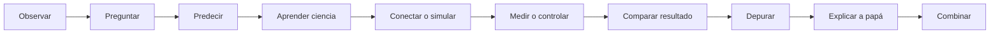

# Arquitectura editorial y técnica

## Decisiones de diseño

1. **PX-32 es el protagonista.** El nombre aparece en misiones, ejemplos y mensajes Serial (`Hola, soy PX-32`) para hacer el aprendizaje propio y memorable.
2. **La fuente no se mezcla con la pedagogía.** Los datos de OSOYOO se etiquetan y citan por página; explicaciones y experimentos se presentan como creación del curso.
3. **Los proyectos del manual son hitos.** Antes de cada programa grande se prueban ciencia, señal, lectura, decisión y actuación por separado.
4. **Una conexión canónica.** [mapa-conexiones-robot.md](docs/reference/mapa-conexiones-robot.md) es la única tabla maestra. Las lecciones enlazan a ella en lugar de mantener copias divergentes.
5. **La incertidumbre es visible.** Ningún dato dudoso se completa por intuición. Se registra en [errata-osoyoo.md](docs/reference/errata-osoyoo.md).
6. **El código educativo y el oficial no se mezclan.** `code/educational/` contiene ejemplos mínimos; `code/osoyoo-original/` queda reservado para copias intactas del proveedor.
7. **Seguridad por diseño.** Las actividades de potencia exigen adulto, robot apagado durante cableado y ruedas levantadas en primeras pruebas.

## Flujo de una lección



## Estructura implementada

```text
/
├── README.md, COURSE-MAP.md, PROGRESS.md, ARCHITECTURE.md
├── docs/
│   ├── hardware/        fichas HW-xxx
│   ├── reference/       mapas canónicos y seguridad
│   ├── readings/        ciencia para profundizar
│   └── expansions/      compras futuras justificadas
├── course/              bloques 00 a 08
├── experiments/         protocolos de pruebas aisladas
├── projects/            proyectos integradores
├── code/
│   ├── educational/     ejemplos pequeños
│   └── osoyoo-original/ fuentes del proveedor sin editar
├── templates/
├── assets/osoyoo-manual/
└── reference/original/
```

## Convenciones

- Lecciones: `NN-titulo.md`.
- Hardware: `HW-NNN-nombre.md`.
- Un programa Arduino vive en una carpeta con el mismo nombre que su archivo `.ino`.
- Toda tabla de conexiones indica fuente y estado.
- Una imagen extraída conserva `pagina-NN` en el nombre y se enlaza con ruta relativa.
- El cierre de sesión es conversado; el cuaderno físico es opcional y no existe una arquitectura paralela de evaluaciones o diario digital.

## Estrategia de imágenes del PDF

La primera selección conserva páginas completas a 150 dpi. Esto mantiene juntas flechas, leyendas y tablas, evita recortes ambiguos y permite comprobar el número de página. Solo se eligieron inventario, pinouts, potencia, ruedas e interfaces. Las capturas antiguas del IDE se conservan como referencia histórica, pero las lecciones de instalación describen Arduino IDE 2 con enlaces oficiales vigentes.

Si en una fase posterior se recortan figuras, cada recorte debe conservar en el pie: manual, página y descripción. La página completa original seguirá disponible para auditar el contexto.
