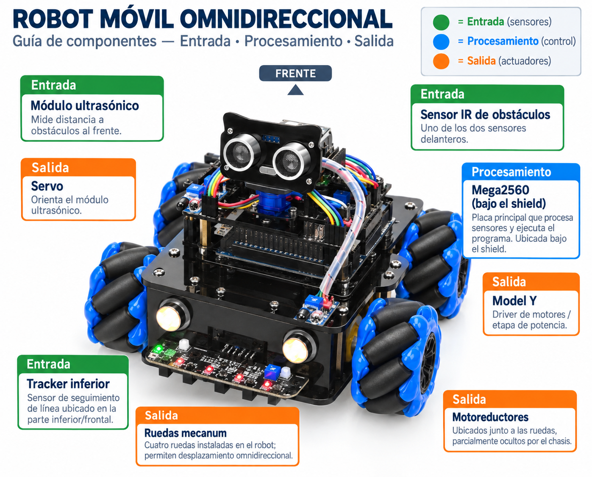

# Lección 01 — ¿Qué es un robot?

## Una máquina que recibe pistas y cambia el mundo

Imagina que dejas a PX-32 frente a una caja. El robot podría detectar la caja, usar un programa para elegir una respuesta y mover sus ruedas. Pero hoy estará apagado. Antes de pedirle que haga algo, vamos a descubrir qué lo convierte en un robot.

Una rueda sola no es un robot. Un sensor solo tampoco. PX-32 es un **sistema**: varias piezas colaboran para lograr un resultado. En este curso observaremos tres trabajos:

- **percibir:** recibir información de un sensor o un comando;
- **procesar:** usar instrucciones para decidir qué hacer;
- **actuar:** producir un cambio, por ejemplo girar una rueda, orientar el sensor ultrasónico o encender una luz.

Un **robot** es un sistema programable que recibe información y puede actuar sobre su entorno. No necesita parecer una persona. Tampoco “piensa” como nosotros: su microcontrolador ejecuta instrucciones. Si un programa compara una señal y ordena un giro, la decisión proviene de reglas escritas por alguien.

En Scratch ya conociste una idea parecida. Un bloque puede esperar un evento, comprobar una condición y mover un personaje. En PX-32, la entrada llega desde piezas físicas, el programa se ejecuta en una placa y la salida puede mover algo real. Por eso una instrucción equivocada no solo cambia una imagen en pantalla: más adelante podría mover una rueda.

## Nuestro semáforo de seguridad

Los iconos del curso indican quién puede realizar cada acción:

- 🟢 Puedes hacer el paso por ti mismo.
- 🟡 Un adulto debe estar presente y supervisar.
- 🔴 Detente y llama a tu padre: el adulto realiza o verifica esa parte.

No son premios ni niveles de dificultad. Aparecen donde existe un riesgo concreto. Preguntar y detenerse también son acciones correctas.

## La misión: encontrar seis piezas y explicar su trabajo

Al terminar podrás clasificar seis piezas de PX-32 como entrada, procesamiento o salida. Cada clasificación debe incluir una razón visible; “porque parece un sensor” no basta.

### Lo que vas a necesitar

- PX-32 completamente ensamblado.
- Una mesa seca, despejada y estable.
- Seis trozos pequeños de papel.
- Un lápiz.
- Una linterna y un espejo pequeño, opcionales, para mirar debajo sin levantar el robot.
- El [diccionario de hardware](../../docs/hardware/README.md) abierto en el computador para resolver dudas.
- Ningún programa ni archivo `.ino`: hoy el robot no se conecta al computador.

### Antes de acercarte

🔴 Detente y llama a tu padre. Él debe confirmar estas tres condiciones: el cable USB está desconectado, los interruptores del portabaterías y del UART WiFi Shield están apagados, y no hay calor, olor extraño, cables sueltos ni piezas dañadas. El niño no retira ni inserta baterías 18650.

Si el adulto no puede asegurar que PX-32 está sin energía, la actividad se hace únicamente con el manual y continúa sobre el robot otro día.

### Prepara tus tarjetas

🟢 Escribe dos tarjetas con la palabra `ENTRADA`, una con `PROCESAMIENTO` y tres con `SALIDA`.

Antes de seguir, predice: ¿qué grupo crees que tendrá más piezas visibles en la parte delantera? Conserva la respuesta; al final comprobarás si la ubicación realmente demuestra la función.

### Exploración, de adelante hacia adentro

1. 🟢 Busca el frente sin mover el robot. Es el lado donde están el módulo ultrasónico —la placa con dos cilindros metálicos redondos— y los sensores delanteros. Si esas piezas no están instaladas o no sabes cuál es el frente, marca la duda y consulta el manual; no lo adivines por la posición de las ruedas.

2. 🟢 Coloca una tarjeta `ENTRADA` junto al **módulo ultrasónico**, sin apoyarla sobre el circuito. Sus dos transductores —piezas que transforman una forma de energía en otra— envían y reciben sonido de alta frecuencia. En lecciones posteriores el tiempo del eco servirá para estimar distancia. Hoy basta esta evidencia: tiene una parte emisora y otra receptora orientadas hacia el entorno.

3. 🟢 Busca uno de los **dos sensores IR de obstáculos**: son pequeñas placas delanteras, cada una con un par de componentes que apuntan al frente y un pequeño ajuste llamado potenciómetro. No lo gires. Coloca la segunda tarjeta `ENTRADA`. Estos sensores detectan si regresa suficiente luz infrarroja; no miden centímetros exactos.

4. 🟢 Usa el espejo, si hace falta, para mirar bajo el borde delantero. Localiza el **tracker de cinco canales**, una placa alargada que mira al suelo. No levantes PX-32. Aunque también usa infrarrojo, su posición le permite observar el contraste de una pista bajo el robot. Esta es una séptima pieza de exploración; no necesita tarjeta en la clasificación de seis.

5. 🟢 Busca la **Mega2560**. Es la placa grande que está debajo del UART WiFi Shield; el conector USB cuadrado y los bordes de la placa ayudan a reconocerla. Coloca `PROCESAMIENTO` a su lado. La Mega recibe señales, ejecuta el programa y produce señales de control. El shield que está encima distribuye conexiones; no sustituye al microcontrolador.

6. 🟢 Coloca una tarjeta `SALIDA` junto al **servo** que sostiene el sensor ultrasónico. Es un actuador: recibe una señal de posición y gira el soporte. No intentes girarlo con la mano.

7. 🟢 Coloca otra tarjeta `SALIDA` junto a uno de los **motores amarillos con reductora**. El motor transforma energía eléctrica en giro; la caja amarilla contiene engranajes. La rueda transmite ese giro al suelo. No hagas girar la rueda ni metas los dedos entre rueda, eje y chasis.

8. 🟢 Usa la última tarjeta `SALIDA` para uno de los **faros delanteros**. Un LED transforma energía eléctrica en luz. En el montaje del manual estos faros se conectan a alimentación, no a un pin de control individual; por eso “salida” describe el efecto físico, no afirma que el programa pueda gobernarlos por separado.

9. 🟢 Recorre las seis tarjetas. Para cada una completa en voz alta: “La clasifiqué como ___ porque puedo observar ___ y su función documentada es ___”. Si no encuentras evidencia suficiente, escribe `DUDA` en esa tarjeta. Una duda honesta vale más que un nombre inventado.

10. 🟢 Retira todas las tarjetas y deja el robot exactamente como estaba. No debe haberse movido ningún cable, conector, interruptor, potenciómetro ni pieza mecánica.

### Cómo saber si lo lograste

La misión está completa si puedes defender seis clasificaciones y señalar al menos una diferencia entre estas ideas:

- un sensor entrega información, pero no decide por sí solo el objetivo del robot;
- el programa organiza decisiones, pero no aporta la potencia de un motor;
- un actuador produce el cambio físico, pero necesita energía y una orden adecuada.

La ubicación ayuda a reconocer una pieza, pero no prueba su función. La prueba más fuerte combina **forma o etiqueta + conexión documentada + efecto esperado**.

## Si algo no coincide

| Lo que observas | Qué significa | Qué hacer |
|---|---|---|
| La Mega está casi oculta por otra placa | El UART WiFi Shield está apilado sobre ella | Busca el conector USB y el borde de la placa; no retires el shield |
| No ves el tracker | Está montado bajo el frente y mira al suelo | Usa un espejo o pide al adulto que indique la zona; no levantes el robot tú solo |
| Una pieza se parece a la foto, pero no tiene la misma etiqueta | Puede existir una variante del kit | Registra la etiqueta exacta y déjala como duda hasta compararla con la ficha correspondiente |
| Hay un cable suelto, daño, calor u olor | La condición inicial no es segura | 🔴 No toques ni conectes nada; el adulto aísla la alimentación y revisa |
| Alguien propone encender para “comprobar rápido” | La prueba ya no sería la actividad segura de hoy | Mantén PX-32 apagado; las pruebas activas llegarán después de preparar hardware y programa |

## Un reto de clasificación

¿Un botón de control remoto es entrada o salida? Depende del límite que dibujes alrededor del sistema. Tocar el botón es una entrada para el teléfono; el mensaje de radio es una salida del teléfono y, al llegar, una entrada para PX-32. Elige otro objeto cotidiano —por ejemplo, una puerta automática—, dibuja primero el límite del sistema y separa lo que percibe, lo que decide y lo que actúa.

## Lecturas y videos para explorar

- [¿Qué es un ROBOT?](https://www.youtube.com/watch?v=xvzg-oTZ7wM) — Español; video; 4 min.
**Por qué este recurso:** confirma lo visto al explicar con ejemplos reales qué hace que una máquina sea un robot: percibir, decidir y actuar, con un estilo directo y sin tono infantil.

- [How do robots experience the world?](https://www.youtube.com/watch?v=FeRxP2Z27C4) — Inglés sencillo, hablado despacio; video; 8 min.
**Por qué este recurso:** profundiza la idea de percibir-procesar-actuar mostrando cómo los sensores son como los sentidos de un robot, tal como vas a clasificar las piezas de PX-32 hoy.

- [Los Rovers del Marte](https://spaceplace.nasa.gov/mars-rovers/sp/) — Español; lectura; 10 min.
**Por qué este recurso:** estimula la curiosidad contando cómo los rovers de la NASA perciben Marte con sensores, procesan con su computadora y actúan con sus ruedas y brazos, igual que PX-32 pero en otro planeta.

Cuando las explores, piensa: ¿cuál es la pieza que percibe, la que decide y la que actúa en cada robot que viste?

## Referencias técnicas de la clase

- [Manual oficial OSOYOO del kit](https://osoyoo.com/manual/2021006600-2026.pdf), páginas 2 a 21, 26, 39 y 44.
- [Arduino Mega 2560 Rev3](https://docs.arduino.cc/hardware/mega-2560/), descripción oficial de la placa y sus funciones.
- [Seguridad del laboratorio PX-32](../../docs/reference/seguridad.md).

## Cuéntale a papá

Muéstrale dos tarjetas que pertenezcan a grupos distintos. Explícale qué evidencia usaste y por qué “estar en la parte delantera” no basta para saber la función. Termina la conversación con esta pregunta: **¿qué dejaría de poder hacer PX-32 si retiráramos el sensor, el programa o el actuador?**

En la [Lección 02: Inventario razonado de PX-32](02-inventario-razonado-de-px-32.md) convertirás esta primera clasificación en un mapa preciso de quince componentes.
