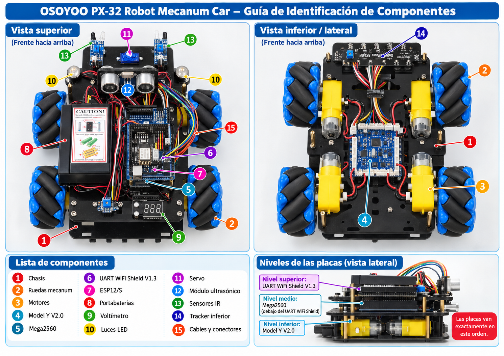

# Lección 02 — Inventario razonado de PX-32

## No basta con decir “esa placa azul”

Si alguien te pidiera revisar PX-32 porque “una cosa de adelante no funciona”, ¿sabrías cuál cosa? Hay sensores infrarrojos, un sensor ultrasónico, un servo y dos luces muy cerca unos de otros. Un buen constructor no se guía solo por el color o por una fotografía parecida: reúne **evidencia**.

La evidencia para identificar un componente puede venir de cuatro lugares:

- la **forma**, como los dos cilindros metálicos del módulo ultrasónico;
- la **cantidad**, como las cuatro ruedas Mecanum;
- la **posición**, como el tracker que mira al suelo;
- la **serigrafía**, es decir, las palabras y símbolos impresos en una placa.

La identificación es más sólida cuando coinciden varias pistas. “Es el Model Y porque está abajo, tiene conectores para los motores y la placa dice `Model Y v2.0`” es mejor que “es la placa azul”.

También aprenderás a decir “no confirmado”. El manual contiene algunas contradicciones y el kit puede tener variantes. Marcar una duda no significa que fallaste; significa que no convertiste una suposición en un hecho.

## La misión: construir un mapa de quince identificaciones

Vienes de la [Lección 01](01-que-es-un-robot.md), donde separaste entrada, procesamiento y salida. Ahora vas a localizar quince partes o conjuntos y justificar cada nombre con una pista visible o documental.

### Materiales y preparación

- PX-32 ensamblado.
- Una mesa seca, despejada y bien iluminada.
- Lápiz y una hoja con tres columnas: `NOMBRE`, `EVIDENCIA`, `FUNCIÓN`.
- Una linterna y un espejo pequeño; no uses una herramienta metálica para señalar.
- El [diccionario de hardware](../../docs/hardware/README.md) y la [versión verificable del manual](../../reference/osoyoo-manual.md) abiertos en el computador.
- El [mapa de conexiones](../../docs/reference/mapa-conexiones-robot.md) disponible solo para comprobar rutas; hoy no se cambia ninguna.
- Ningún programa, Arduino IDE ni archivo `.ino`.

🔴 Antes de comenzar, el adulto confirma que no hay USB conectado, que los interruptores están apagados y que PX-32 no presenta calor, olor, daño o piezas sueltas. Las baterías 18650 y el cargador quedan fuera de la manipulación del niño.

🟡 Si hace falta cambiar la orientación del robot para ver un costado, el adulto mueve el chasis completo sujetándolo por sus placas estructurales. No lo toma por el ultrasónico, los cables, las ruedas ni el portabaterías.

### Primero encuentra el frente y los dos niveles

El frente es el lado donde el manual instala las dos luces, los dos sensores IR y el módulo ultrasónico. El chasis tiene un nivel superior y otro inferior unidos por separadores. Esta orientación será tu punto de referencia; todavía no asignaremos “izquierda” o “derecha” a cables que no podamos seguir con certeza.

Antes de mirar la tabla, predice qué nivel contiene la placa que decide y cuál contiene la placa que entrega potencia a los motores. Escribe ambas respuestas sin corregirlas aún.

### Ruta de inspección

Recorre la tabla en orden. No marques una fila hasta poder completar una frase del tipo “Lo reconozco por ___ y sirve para ___”.

| Nº | Qué debes localizar | Cómo reconocerlo sin desmontar | Función que debes poder explicar |
|---:|---|---|---|
| 1 | **Chasis** | Dos placas estructurales unidas por separadores, con ranuras y tornillos | Mantiene cada componente en una posición conocida |
| 2 | **Cuatro ruedas Mecanum** | Cuatro ruedas con rodillos inclinados; existen dos orientaciones | Transmiten fuerzas al suelo y permiten combinar movimiento longitudinal y lateral |
| 3 | **Cuatro motores DC con reductora** | Cajas amarillas junto a las ruedas, con una parte metálica y un eje | Transforman energía eléctrica en giro; los engranajes reducen velocidad y aumentan la fuerza de giro, llamada par |
| 4 | **OSOYOO Model Y V2.0** | Placa del nivel inferior, cerca de los cuatro motores, con conectores `AK` y `BK` y serigrafía `Model Y v2.0` | Recibe señales de control y abre o cierra rutas de potencia hacia los motores |
| 5 | **OSOYOO Mega2560 R3** | Placa grande bajo el shield; el conector USB tipo B, el conector de alimentación y parte de la palabra `MEGA` ayudan a distinguirla | Contiene el microcontrolador que ejecuta el programa |
| 6 | **UART WiFi Shield V1.3** | Placa apilada sobre la Mega, con filas de conectores de tres pines y rótulos de UART | Distribuye alimentación y señales; no reemplaza a la Mega |
| 7 | **ESP8266 / encapsulado ESP12/S** | Rectángulo metálico o módulo con la marca `ESP12/S` y una antena impresa en el borde del shield | Gestiona la conectividad Wi-Fi documentada del kit |
| 8 | **Portabaterías** | Caja negra para dos celdas cilíndricas, fijada al nivel superior y con interruptor | Sostiene las celdas y lleva su energía al Model Y |
| 9 | **Voltímetro de tres dígitos** | Pequeño display numérico montado cerca de un borde y conectado al Model Y | Muestra una lectura aproximada del voltaje; no informa un porcentaje exacto de carga |
| 10 | **Dos luces LED delanteras** | Dos módulos redondos o faros en la placa frontal, con cables rojo y negro en el manual | Transforman energía eléctrica en luz visible |
| 11 | **Microservo, documentado como MG90** | Caja pequeña bajo el soporte del ultrasónico, con eje y cable de tres conductores; la etiqueta física del modelo puede quedar oculta | Busca una posición angular para orientar el sensor |
| 12 | **Módulo ultrasónico** | Placa frontal con dos cilindros metálicos grandes, uno transmisor y otro receptor | Envía una ráfaga de sonido y permite medir el tiempo del eco |
| 13 | **Dos sensores IR de obstáculos** | Dos placas pequeñas en el frente, cada una con emisor/receptor y un potenciómetro, el pequeño control de ajuste | Indican si la reflexión infrarroja supera un umbral; no dan distancia exacta |
| 14 | **Tracker IR de cinco canales** | Placa alargada bajo el frente, orientada hacia el suelo, con cinco zonas sensoras | Produce un patrón de cinco estados para localizar una línea |
| 15 | **Cables y conectores instalados** | Manojos de cables de 2, 3, 6 o 7 posiciones, carcasas plásticas y rótulos impresos en la placa junto a sus extremos | Llevan energía o señales; el color por sí solo no demuestra su función |

### Cómo registrar evidencia de verdad

En el nombre `UART WiFi Shield`, **UART** se refiere a un sistema para intercambiar datos en serie, es decir, uno detrás de otro. Aprenderás sus reglas más adelante; aquí solo necesitas reconocer que nombra una función de comunicación y no al microcontrolador principal.

1. 🟢 Empieza por las piezas grandes: chasis, ruedas y motores. Cuenta las unidades. Si ves tres motores y supones que hay un cuarto oculto, aún no has completado la fila: cambia tu punto de vista o usa el espejo.

2. 🟢 Mira el nivel inferior desde un costado y localiza la serigrafía del Model Y. No metas el espejo entre cables ni apoyes la mano sobre la placa. Comprueba que sus conectores van hacia los motores sin tirar de ellos.

3. 🟢 En el nivel superior, separa visualmente tres cosas: la Mega es la placa base, el UART WiFi Shield está apilado encima y `ESP12/S` es un módulo que forma parte del shield. Escribe una función distinta para cada una.

4. 🟢 Observa el portabaterías y el voltímetro sin tocar interruptores. El manual documenta la ruta `portabaterías → VIN del Model Y`, pero no explica con suficiente claridad si las dos celdas están conectadas internamente en serie o en paralelo. Anota `configuración interna: no confirmada`.

5. 🟢 Recorre el frente desde arriba: luces, sensores IR, ultrasónico y servo. Luego usa el espejo para ver el tracker por debajo. Comprueba que “IR” aparece en dos tipos de sensor con trabajos diferentes: los de obstáculos miran al frente; el tracker mira al suelo y tiene cinco canales.

6. 🟢 Sigue con la vista un solo cable desde una pieza hasta el siguiente conector. Detente si el cable queda oculto. El manual advierte que los conectores de seis pines se sujetan por la carcasa plástica, nunca por los hilos; hoy no debes retirarlos.

7. 🟢 Revisa tus quince filas. Para aceptar una identificación, exige al menos dos pistas cuando sean visibles. Por ejemplo: `posición + etiqueta`, `forma + cantidad` o `conexión + función documentada`.

8. 🟢 Encierra en un círculo cualquier dato que no pudiste comprobar. No cambies una fila para que coincida con la respuesta esperada. Una etiqueta física distinta puede indicar una variante que debe revisar un adulto.

9. 🟢 Compara tus dos predicciones iniciales. La Mega del nivel superior procesa; el Model Y del nivel inferior maneja la potencia de los motores. Explica por qué una placa más cerca de los motores no es necesariamente “el cerebro”.

10. 🟢 Termina dejando la hoja a un lado y verificando visualmente que ninguna tarjeta, espejo o lápiz quedó dentro del chasis. PX-32 permanece apagado y sin cambios.

### La confusión que debes evitar desde hoy

`ESP12/S` identifica el encapsulado del módulo basado en **ESP8266** documentado por el proyecto. No es una ESP32. La semejanza entre los nombres no es evidencia de que sean el mismo chip.

El **HC-02**, cuando está presente, es el módulo Bluetooth que se inserta en un zócalo de seis pines. Tampoco es el ESP. Si no está instalado en tu robot, no inventes una ubicación para completar el inventario; registra que es una pieza externa o pendiente de confirmar.

## Criterio de éxito

Has terminado cuando puedes mostrar quince identificaciones sustentadas y responder:

- ¿qué evidencia distingue la Mega del shield?
- ¿qué evidencia distingue el shield del Model Y?
- ¿qué dos familias de sensores infrarrojos hay y hacia dónde miran?
- ¿qué dato del portabaterías sigue sin confirmarse?
- ¿por qué el color de un cable no demuestra qué transporta?

No es necesario memorizar códigos `HW-xxx`. Sí debes poder volver a encontrar una pieza sin que un adulto improvise una descripción nueva.

## Si una pieza se resiste a ser identificada

| Dificultad concreta | Comprobación útil | Decisión segura |
|---|---|---|
| La etiqueta queda oculta | Busca forma, posición y conexión en el manual | Déjala como probable, no como confirmada; no desmontes para verla |
| Mega y shield parecen una sola placa | Identifica el conector USB tipo B en la placa inferior y `ESP12/S` en la superior | Dibuja dos niveles en tu hoja |
| No sabes si un sensor IR es izquierdo o derecho | Orienta primero el frente y compara la conexión documentada | No asignes lado si el cable no puede seguirse sin moverlo |
| El voltímetro está apagado | Esa es la condición correcta de esta actividad | Identifícalo por el display y su conexión; no energices para obtener un número |
| La cantidad o el modelo no coincide con la tabla | Puede ser un montaje incompleto o una variante | Fotografía la etiqueta con ayuda adulta y consulta la ficha; no fuerces piezas |
| Encuentras daño o un conector desplazado | Ya no es solo un problema de nombres | 🔴 Detente; el adulto decide cómo aislar y revisar el sistema |

## Lecturas y videos para explorar

- [An Introduction To Robotics (Sense-Plan-Act)](https://www.youtube.com/watch?v=HvMQONnCXbE) — Inglés sencillo; video; 30 min (puedes verlo por partes).
**Por qué este recurso:** profundiza tu inventario con un recorrido completo por las familias de piezas de un robot: sensores de varios tipos, cámaras, computadoras de a bordo y motores, con ejemplos de robots verdaderos.

- [Radar de componentes: fichas del hardware de PX-32](../../docs/hardware/README.md) — Español; lectura interna; 10 min.
**Por qué este recurso:** confirma tu clasificación al darte la ficha de cada componente del robot, con su trabajo, sus pistas visibles y las cosas que aún nadie ha comprobado.

- [Electrical Circuits](https://www.youtube.com/watch?v=HOFp8bHTN30) — Inglés sencillo, con animaciones; video; 5 min.
**Por qué este recurso:** estimula tu siguiente lección mostrando cómo un circuito lleva energía por todo un circuito cerrado, la misma idea que late bajo cada cable que inventariaste hoy.

Explóralos con una pregunta en mente: ¿qué pieza de tu inventario haría cada trabajo que muestran estos recursos?

## Referencias técnicas de la clase

- [Manual oficial OSOYOO del kit](https://osoyoo.com/manual/2021006600-2026.pdf), páginas 4 a 21, 26, 34, 39, 44 y 52.
- [OSOYOO Model Y H-Bridge 4-Channel Motor Driver](https://osoyoo.com/2022/02/25/osoyoo-model-y-4-channel-motor-driver/), identificación y función de la revisión V2.0.
- [Arduino Mega 2560 Rev3](https://docs.arduino.cc/hardware/mega-2560/), anatomía y capacidades de la placa de referencia.
- [Erratas e incertidumbres del manual](../../docs/reference/errata-osoyoo.md).

## Cuéntale a papá

Elige la identificación más fácil y la más dudosa. Para la primera, muestra las dos pistas que coinciden. Para la segunda, explica qué información faltó y qué acción evitaste por seguridad. Luego pídele que señale una pieza al azar y responde con nombre, evidencia y función.

En la [Lección 03: Electricidad sin misterios](03-electricidad-sin-misterios.md) seguirás la ruta de energía que permite trabajar a todas estas piezas.
