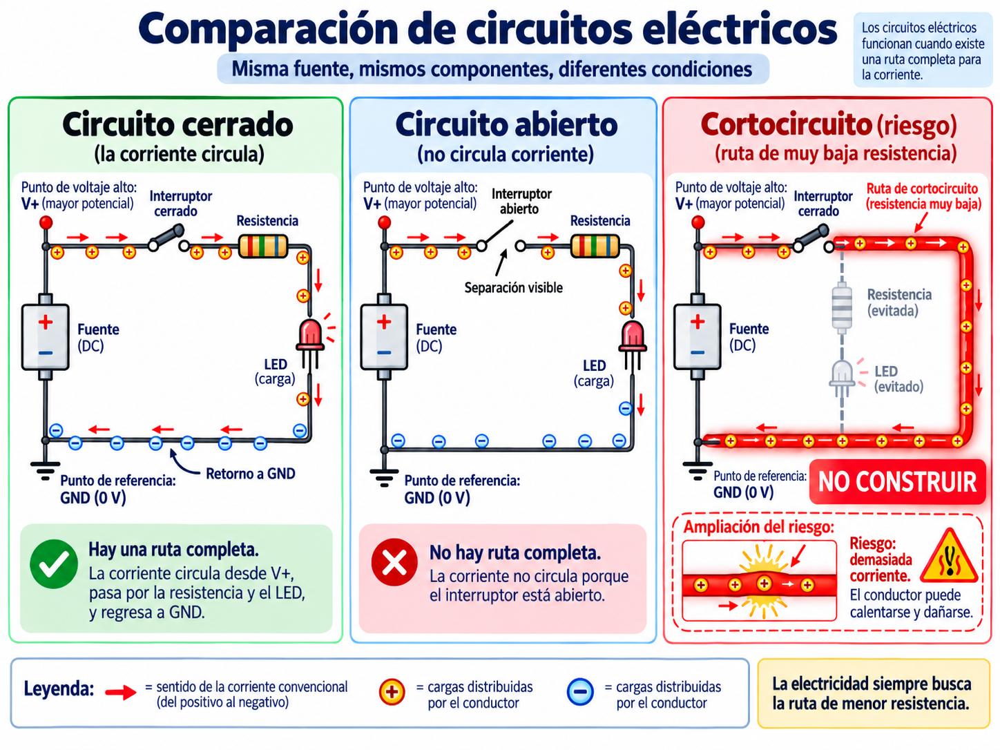

# Lección 03 — Electricidad sin misterios

## ¿Por qué un interruptor tan pequeño puede detener todo el robot?

En la lección anterior encontraste un interruptor en el portabaterías. No guarda órdenes ni sabe qué es un robot. Su trabajo es más sencillo y decisivo: permitir o interrumpir una ruta eléctrica.

La materia contiene **carga eléctrica**. En un material conductor ya existen cargas capaces de responder. Cuando hay una diferencia de energía eléctrica entre dos puntos y un camino completo, puede aparecer corriente.

Necesitamos separar tres ideas que suelen mezclarse:

- **voltaje:** diferencia de potencial eléctrico entre dos puntos; se mide en voltios (`V`);
- **corriente:** flujo de carga por unidad de tiempo a través de una sección; se mide en amperios (`A`);
- **resistencia:** oposición que presenta un camino al paso de la corriente; se mide en ohmios (`Ω`).

Por acuerdo, los diagramas dibujan la **corriente convencional** desde el punto de mayor potencial hacia el de menor potencial. En los metales, los electrones se desplazan en el sentido opuesto. No cambiaremos de convención a mitad del circuito.

Una comparación con agua puede ayudar al principio: el voltaje se parece a una diferencia de presión, la corriente al flujo y la resistencia a una restricción. Pero la electricidad no es agua dentro de cables huecos. El metal ya contiene cargas y el campo eléctrico se establece a lo largo del circuito; la comparación solo sirve para distinguir empuje, flujo y oposición.

## Un circuito siempre cuenta una historia completa

Un **circuito** es una ruta cerrada por la cual puede circular corriente. La fuente crea una diferencia de potencial, los conductores forman el camino y una carga —por ejemplo, un LED o un motor— transforma energía.

Cuando un interruptor está **abierto**, existe una separación y no puede mantenerse una corriente por esa ruta. Cuando está **cerrado**, completa el camino. “Cerrado” puede sonar como “bloqueado”, pero en electricidad significa que el contacto deja pasar corriente.

Un **cortocircuito** no es simplemente “un circuito corto”. Es una ruta de resistencia muy baja que evita la carga prevista. Puede permitir una corriente capaz de calentar conductores, celdas o placas. Por eso hoy no construiremos un circuito eléctrico real: lo representaremos con papel.

### ¿Y qué es GND?

`GND` se lee *ground* y en PX-32 funciona como referencia común para comparar voltajes y como parte del camino de retorno. No es “electricidad negativa”, ni un agujero donde desaparece la corriente. Cuando dos módulos intercambian una señal eléctrica, normalmente necesitan compartir una referencia para interpretar de la misma manera las dos regiones lógicas llamadas `LOW` —nivel bajo— y `HIGH` —nivel alto—.

Los rótulos `3.3V`, `5V`, `VIN` y `GND` no son intercambiables. `VIN` es una entrada de alimentación; no significa “otro pin de 5 V”. Una fila de tres pines `S/V/GND` separa señal, alimentación y referencia. El nombre impreso y el diagrama del componente exacto mandan.

## La misión: hacer visible una ruta que normalmente no vemos

Usarás fichas de papel para demostrar por qué una ruta cerrada permite corriente y una abierta la interrumpe. Después localizarás, solo con la vista y el mapa, la ruta de alimentación documentada de PX-32.

### Lo que necesitas

- PX-32 ensamblado y sin energía.
- El [mapa canónico de conexiones](../../docs/reference/mapa-conexiones-robot.md) abierto en el computador.
- Una hoja grande o cuatro tiras de papel para formar un rectángulo.
- Cinco tarjetas con los rótulos `FUENTE`, `INTERRUPTOR`, `RESISTENCIA`, `CARGA` y `GND`.
- Seis monedas, botones o fichas de juego que representarán carga presente en el conductor.
- Un lápiz.
- No necesitas pilas, cables sueltos, LED, multímetro, Arduino IDE ni código.

🔴 El adulto confirma que el USB está desconectado y los interruptores están apagados. El niño no retira baterías, no abre el portabaterías y no toca `VIN`, `VOUT` ni conectores de potencia. Si no puede verificarse el estado, realiza únicamente el modelo de papel.

### Construye el circuito de papel

1. 🟢 Coloca las cuatro tiras formando un camino rectangular cerrado. Pon `FUENTE` en un lado y marca sus extremos con `+` y `−`. Distribuye `INTERRUPTOR`, `RESISTENCIA` y `CARGA` a lo largo de la ruta; coloca `GND` cerca del regreso a la fuente. La palabra GND indica una referencia elegida dentro del circuito; la ficha no consume cargas.

2. 🟢 Reparte las seis monedas a lo largo de todo el camino, no amontonadas en `FUENTE`. Esta colocación recuerda que un conductor contiene cargas antes de cerrar el interruptor.

3. 🟢 Dibuja dos puntos, `A` y `B`, a cada lado de la fuente. Escribe: `voltaje = diferencia entre A y B`. Pregunta de predicción: si ambos puntos tuvieran el mismo potencial, ¿existiría el “empuje” eléctrico que queremos representar?

4. 🟢 Cierra el interruptor de papel uniendo las dos puntas de su tira. Mueve cada moneda una posición alrededor del circuito. Una vuelta completa representa corriente sostenida por una ruta cerrada y energía transformada en la carga.

5. 🟢 Detente para corregir el modelo: en un circuito real las cargas no esperan a que una moneda complete toda la vuelta para que la siguiente se mueva. Mover fichas por turnos solo nos ayuda a comprobar que ninguna ruta termina en un callejón sin salida.

6. 🟢 Abre el interruptor separando sus dos puntas unos centímetros. Predice qué ocurrirá y trata de continuar la vuelta sin saltar el hueco. Debes descubrir que la ruta ya no es continua. La evidencia de la actividad es geométrica: hay una interrupción visible; no estamos midiendo corriente real.

7. 🟢 Vuelve a cerrar el camino y dibuja una línea en zigzag sobre la tarjeta `RESISTENCIA`. Si aumentara la oposición manteniendo las demás condiciones, la corriente tendería a disminuir. No hace falta calcularla todavía.

8. 🟢 Dibuja con lápiz una ruta directa desde un lado de la fuente hasta el otro que evite la carga. Rodéala en rojo y escribe `CORTOCIRCUITO: NO CONSTRUIR`. La ruta de papel es segura; reproducirla con una batería y un cable no lo sería.

### Lleva el modelo hasta PX-32 sin tocar conexiones

9. 🟢 Orienta el robot como en la lección anterior. En la pantalla, sigue la ruta documentada: `2 celdas 18650 → portabaterías → VIN del Model Y`. Desde el Model Y, una rama entrega energía a los motores y otra sale por `VOUT` hacia `VIN` del UART WiFi Shield.

10. 🟢 Señala las piezas desde fuera del chasis. No sigas un cable oculto con los dedos. Observa que el cable de potencia tiene que incluir tanto ida como retorno, aunque el dibujo resumido no muestre cada conductor por separado.

11. 🟢 Busca en una fila del shield las etiquetas `S`, `V` y `GND`. No conectes nada. Explica: `S` transporta una señal, `V` alimenta el módulo y `GND` proporciona la referencia y el retorno común. Un mismo sistema eléctrico puede llevar **energía** y también representar **información**.

12. 🟢 Compara el interruptor real con tu tarjeta. Cuando el interruptor abre la ruta, las ruedas no reciben energía de las celdas por ese camino. Eso no demuestra que todo el robot esté sin energía si otra fuente —como USB— estuviera conectada; por eso la comprobación inicial revisa todas las fuentes.

13. 🟢 Escribe junto al dibujo del robot: `No sabemos aún: serie/paralelo, límites exactos del Model Y y especificaciones del cargador`. El manual entregado no basta para afirmar esos datos. No sumes los voltajes nominales de las celdas hasta verificar su conexión interna.

14. 🟢 Aleja las fichas y papeles del robot. Comprueba que nada quedó dentro del chasis y que no se movió ningún interruptor ni conector.

## Qué debes poder demostrar

La actividad está completa si puedes construir:

- una ruta cerrada coherente, sin saltos;
- la misma ruta abierta en un solo punto, explicando por qué ya no sostiene corriente;
- un dibujo de cortocircuito que identificas como peligroso y que nunca pruebas con hardware real;
- la ruta de alimentación documentada de PX-32, separando lo confirmado de lo pendiente.

Luego di con tus palabras la diferencia entre voltaje, corriente y resistencia. Si la explicación usa “cantidad de electricidad guardada” para corriente o trata GND como una fuente, vuelve a las definiciones del comienzo.

## Si el modelo te engaña

| Problema | Pista para corregirlo |
|---|---|
| Las monedas empiezan todas dentro de la fuente | Distribúyelas por el conductor: representan cargas que ya están en el material |
| Puedes continuar después de abrir el interruptor | Estás saltando el hueco; ninguna ficha puede abandonar la ruta de papel |
| Dices que el voltaje “circula” | Marca dos puntos: el voltaje es una diferencia entre ellos; la corriente es la magnitud asociada al flujo de carga |
| Dibujas GND como un recipiente que se llena | Conecta GND a la ruta de retorno y úsalo como referencia para comparar voltajes |
| Quieres comprobar un corto con una celda | 🔴 No lo hagas. Un camino de muy baja resistencia puede producir calor y daño |
| El mapa parece indicar el voltaje exacto de todo el robot | Solo muestra la ruta; la configuración de las celdas y varios límites eléctricos siguen pendientes de verificación |

## Una variación controlada

Abre el circuito en tres lugares distintos, uno por vez: antes de la carga, después de la carga y en el retorno. En cada caso pregunta si existe una vuelta completa. La posición del hueco cambia; el resultado esencial no: una sola interrupción rompe la ruta.

## Lecturas y videos para explorar

- [La electricidad — vídeos educativos para niños](https://www.youtube.com/watch?v=Ad9dA9atU4Q) — Español; video; 5 min.
**Por qué este recurso:** confirma tu modelo de ruta cerrada al explicar con animaciones cómo la corriente viaja siempre por un camino completo, desde la pila hasta la bombilla y de regreso.

- [Kit de Construcción de Circuitos: CD (PhET)](https://phet.colorado.edu/sims/html/circuit-construction-kit-dc/latest/circuit-construction-kit-dc_es.html) — Español; simulador interactivo; sesión libre.
**Por qué este recurso:** profundiza lo practicado dejándote armar circuitos virtuales con pilas, cables y bombillas: puedes abrir el circuito donde quieras y ver en pantalla por qué la luz se apaga.

- [Circuito eléctrico y materiales conductores](https://www.youtube.com/watch?v=a4mY3YMNLz8) — Español; video; 4 min.
**Por qué este recurso:** estimula tu próximo paso con el experimento de la bombilla, la pila y los cables, y te enseña a distinguir materiales que conducen la electricidad de los que la bloquean.

Cuando los explores, busca la respuesta a esta pregunta: ¿qué pasaría dentro de PX-32 si alguien dejara un cable suelto en la ruta de alimentación?

## Referencias técnicas de la clase

- [Sistema Internacional de Unidades del BIPM](https://www.bipm.org/en/publications/si-brochure), unidades de corriente, diferencia de potencial y resistencia.
- [Manual oficial OSOYOO del kit](https://osoyoo.com/manual/2021006600-2026.pdf), páginas 14 a 16 para la ruta de alimentación documentada.
- [Esquema oficial Arduino Mega 2560](https://docs.arduino.cc/resources/schematics/A000067-schematics.pdf), circuito de alimentación y referencias GND.
- [Alimentación de PX-32](../../docs/reference/alimentacion.md) y [electricidad básica](../../docs/reference/electricidad-basica.md).

## Cuéntale a papá

Muéstrale el modelo primero cerrado y luego abierto. Explícale qué representa cada tarjeta y qué parte de la comparación con monedas no ocurre literalmente dentro de un cable. Por último, señálale el dato que decidiste no inventar sobre el portabaterías.

En la [Lección 04: La Mega2560, una computadora pequeña](04-la-mega2560-una-computadora-pequena.md) seguirás una señal: electricidad que representa información para el programa.
