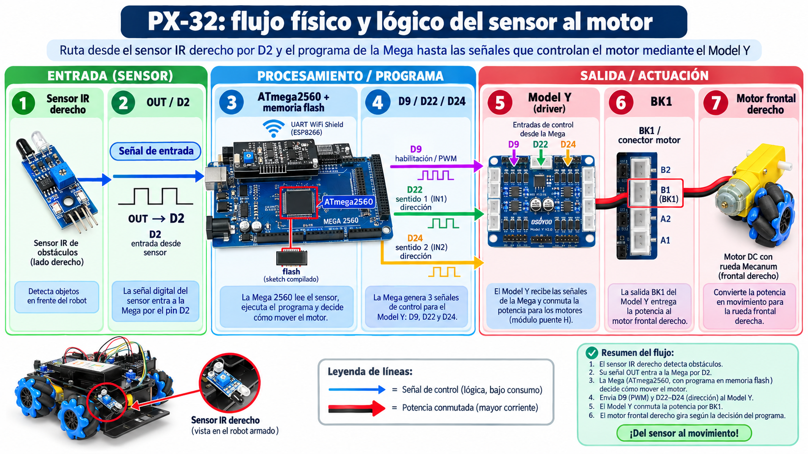

# Lección 04 — La Mega2560: una computadora pequeña

## La placa no es una sola cosa

En un computador puedes reconocer pantalla, teclado y procesador como partes diferentes. En PX-32 ocurre algo parecido, aunque casi todo cabe entre dos placas apiladas.

La **Mega2560** es una placa de desarrollo. Incluye el conector USB, circuitos de alimentación, un botón de reinicio, luces indicadoras, filas de pines y varios chips. El chip principal es el **ATmega2560**, un microcontrolador: un computador pequeño integrado que reúne procesador, memoria y periféricos.

No confundas estas tres capas:

- la **Mega2560** ejecuta el programa y maneja señales;
- el **UART WiFi Shield** está encima y distribuye conexiones, además de incluir el módulo `ESP12/S`;
- el **Model Y** está en el nivel inferior y maneja la potencia de los motores.

El shield no es la Mega y el Model Y no es “otro cerebro”. Una señal pequeña de la Mega puede ordenar al Model Y qué hacer, mientras el Model Y usa la ruta de potencia adecuada para los motores.

> **[PENDIENTE VISUAL]**
> - **Tipo:** fotografía anotada y corte lateral de la Mega2560 con el shield.
> - **Objetivo:** que el niño pueda localizar la placa base, el microcontrolador y las familias de pines sin retirar el shield.
> - **Descripción:** una vista superior de una Mega 2560 sin shield para enseñar su anatomía y, al lado, un corte lateral del montaje PX-32 con el UART WiFi Shield apilado. Mantener el conector USB como referencia de orientación.
> - **Elementos que deben señalarse:** ATmega2560, conector USB tipo B, botón RESET, LED `L`, pines digitales D0-D53, entradas analógicas A0-A15, 5V, 3.3V, GND, VIN y el shield sobre la placa.
> - **Fuente técnica:** pinout oficial Arduino Mega 2560, https://docs.arduino.cc/resources/pinouts/A000067-full-pinout.pdf, páginas 1 y 3; manual OSOYOO, https://osoyoo.com/manual/2021006600-2026.pdf, páginas 9, 10 y 13.
> - **Texto alternativo sugerido:** “Mega2560 orientada desde su conector USB, con el ATmega2560 y las zonas de pines marcadas, junto a un corte del shield apilado”.

## Qué ocurre dentro del microcontrolador

El procesador realiza instrucciones. Las memorias conservan información con propósitos distintos:

- la **memoria flash** guarda el programa, incluso cuando se corta la energía;
- la **SRAM** guarda datos temporales mientras el programa está funcionando y se vacía al apagar;
- la **EEPROM** puede conservar pequeños datos sin energía, aunque no está pensada para escribirla sin límite.

La Mega 2560 de referencia tiene 256 KB de flash —8 KB los usa el *bootloader*—, 8 KB de SRAM y 4 KB de EEPROM. Son cantidades pequeñas frente a un computador portátil, pero suficientes para controlar muchos sensores y actuadores.

Los **periféricos** conectan el procesador con el mundo. Los GPIO son pines digitales de propósito general que el programa puede preparar como entrada o salida. Otros periféricos miden voltajes analógicos, cuentan tiempo o intercambian datos. **UART** es uno de los periféricos de comunicación: envía bits en serie, uno detrás de otro. La placa oficial ofrece 54 pines digitales, 16 entradas analógicas y cuatro UART de hardware; en PX-32 muchos pines ya tienen un trabajo asignado.

Un pin no “sabe” si debe escuchar o hablar. El programa lo configura y el circuito conectado limita lo que puede hacer. Tampoco todos los pines tienen las mismas capacidades. Por eso usaremos el [mapa de conexiones de PX-32](../../docs/reference/mapa-conexiones-robot.md), no un número elegido al azar.

## De Scratch a un archivo `.ino`

En Scratch, las formas de los bloques impiden algunas combinaciones imposibles y muestran visualmente la secuencia. Arduino usa código escrito. Los mismos tipos de ideas aparecerán después —secuencias, repeticiones, condiciones, variables y funciones—, pero tendrás que escribir nombres, signos y paréntesis con precisión.

Los programas de Arduino se llaman **sketches**. El archivo principal suele terminar en `.ino`. Esa extensión indica a las herramientas de Arduino cómo preparar el sketch; el código se convierte en C++, un lenguaje de programación escrito, y después el compilador lo traduce a instrucciones de máquina para la placa. Un archivo `.py` pertenece normalmente a Python y sigue otro proceso. Cambiarle el apellido a un archivo no cambia el lenguaje que contiene.

En este curso, la Mega no usa un sistema operativo convencional como macOS o Ubuntu. Al cargar un sketch, las instrucciones quedan en flash y el microcontrolador puede volver a ejecutarlas después de un reinicio. Existe un pequeño programa de arranque llamado *bootloader*, que ayuda a recibir el sketch compilado y a iniciar su ejecución. Es posible diseñar otros microcontroladores con sistemas operativos de tiempo real, pero ese no es el modelo que usaremos aquí.

Más adelante verás dos nombres especiales en los sketches de Arduino: `setup()` para preparar el comienzo y `loop()` para repetir acciones. Hoy solo necesitas entender el viaje completo: **archivo legible por humanos → compilación → instrucciones en flash → señales en pines → efecto físico**.

## La misión: seguir una señal documentada a través de PX-32

Harás un mapa de una posible reacción del robot, sin encenderlo y sin afirmar que el sketch guardado actualmente realiza esa acción.

### Materiales

- PX-32 ensamblado y sin energía.
- El [pinout relevante de la Mega2560](../../docs/reference/pinout-mega2560.md).
- El [mapa canónico de conexiones](../../docs/reference/mapa-conexiones-robot.md).
- Diez tarjetas de papel y un lápiz.
- Una tira de lana o varias flechas recortadas para representar la ruta; no la introduzcas entre pines.
- Una linterna, opcional.
- Ningún programa, Arduino IDE ni cable USB.

🔴 El adulto comprueba que USB y alimentación de baterías están desconectados o apagados y que no hay daño, calor ni cables sueltos. Nadie retira el shield, cambia conexiones ni gira ruedas durante esta actividad.

### Reconoce las tres placas antes de trazar

1. 🟢 Orienta PX-32 por su frente. Busca la Mega en el nivel superior usando el conector USB tipo B como pista. Después identifica el shield que está encima por `ESP12/S` y las filas de conectores `S/V/GND`.

2. 🟢 Mira desde un costado y encuentra el Model Y en el nivel inferior. Comprueba su nombre impreso y los conectores que van hacia los motores. Di en voz alta: “Mega procesa; shield distribuye; Model Y entrega potencia a motores”.

3. 🟢 Si el ATmega2560 queda oculto por el shield, no desarmes nada. Localízalo en el pinout oficial y coloca una tarjeta `ATmega2560` al lado de la zona donde se encuentra en la placa inferior.

### Construye la ruta de información y acción

4. 🟢 Escribe estas nueve tarjetas: `OBSTÁCULO`, `SENSOR IR DERECHO`, `OUT`, `D2 ENTRADA`, `PROGRAMA EN FLASH`, `DECISIÓN`, `D9 + D22 + D24 SALIDAS`, `MODEL Y`, `MOTOR FRONTAL DERECHO (BK1)`.

5. 🟢 Ordénalas sobre la mesa en esa secuencia. Esta cadena usa conexiones documentadas: el sensor IR derecho entrega `OUT` a D2; para el motor frontal derecho BK1, D9 habilita o modula potencia y D22/D24 determinan dirección mediante el Model Y.

6. 🟢 Antes de acercar las flechas al robot, predice dónde termina la señal de control y dónde comienza la entrega de potencia. La frontera está en el driver Model Y: la Mega envía órdenes; el driver conmuta la energía del motor.

7. 🟢 Busca `D2` en el shield o en el mapa. Es una entrada en esta historia porque recibe el estado del sensor IR derecho. `D` significa digital en el nombre de la placa; la lectura representará uno de dos estados eléctricos, no una distancia en centímetros.

8. 🟢 Sigue en el papel desde D2 hasta `PROGRAMA EN FLASH`. No existe un cable físico desde el pin hasta una cajita llamada “programa”: dentro del microcontrolador, los periféricos y las instrucciones permiten leer el estado. Esta parte de la flecha representa una relación interna.

9. 🟢 Coloca `DECISIÓN` después del programa. La palabra no significa que la Mega tenga intención. Significa que las instrucciones comparan datos y eligen qué señales producir.

10. 🟢 Localiza en el mapa D9, D22 y D24. En esta ruta son salidas de control hacia el Model Y para BK1. No toques los pines ni sigas cables ocultos. Comprueba solo los rótulos y las conexiones del diagrama oficial del kit.

11. 🟢 Termina en el motor frontal derecho. Observa que tres señales de control no suministran directamente la corriente del motor: llegan al Model Y, que controla la ruta de potencia. Si falta el programa correcto, si el pin está mal configurado o si no hay energía, la cadena no produce el efecto previsto.

12. 🟢 Cambia una sola tarjeta: sustituye `OBSTÁCULO` por `SIN OBSTÁCULO`. ¿Qué parte física puede producir ahora un estado diferente? ¿Qué parte de la respuesta depende del programa y no del sensor? No existe una respuesta universal de movimiento: depende de las instrucciones cargadas.

13. 🟢 Escribe en el reverso de `PROGRAMA EN FLASH` un nombre de archivo: `mi_primer_sketch.ino`. Explica por qué `.ino` identifica el archivo fuente, mientras la placa ejecuta instrucciones de máquina compiladas. No necesitas crear el archivo todavía.

14. 🟢 Retira lana y tarjetas. Verifica que ninguna quedó sobre la electrónica o dentro de las ruedas. PX-32 termina exactamente como empezó: apagado, ensamblado y sin cambios.

## Comprobación: ¿tu mapa explica y no solo nombra?

La misión está completa si puedes señalar:

- la placa Mega2560 y el chip ATmega2560, aunque el chip esté oculto en el montaje;
- una entrada digital real, D2;
- la memoria flash como lugar donde queda el programa;
- tres salidas de control documentadas para BK1;
- el Model Y como frontera entre control y potencia;
- el motor como efecto físico final.

También debes poder responder: ¿por qué un `.ino` no es un `.py`?, ¿qué conserva la flash al apagar?, ¿qué pierde la SRAM?, ¿por qué la Mega no necesita un escritorio o ventanas para ejecutar el sketch?

## Cuando el mapa no encaja

| Duda o hallazgo | Cómo resolverlo |
|---|---|
| Solo ves la placa superior | Busca el conector USB de la Mega y usa el corte lateral pendiente; no retires el shield |
| Confundes `ESP12/S` con el microcontrolador principal | El ESP está en el shield para Wi-Fi; el ATmega2560 de la Mega ejecuta el programa principal de este curso |
| No encuentras D22/D24 en la misma fila que D2/D9 | La Mega agrupa pines en varias cabeceras; usa el pinout oficial y conserva la orientación del USB |
| Crees que D2 entrega centímetros | D2 recibe un estado digital del sensor IR; el módulo no mide una distancia exacta |
| Dibujaste Mega → motor directamente | Inserta el Model Y: un GPIO no debe alimentar un motor |
| Una serigrafía o conexión física contradice el mapa | 🔴 No corrijas el cableado; registra la discrepancia y pide al adulto compararla con la [errata](../../docs/reference/errata-osoyoo.md) |

## Un ensayo mental antes del IDE

Imagina que el archivo contiene una palabra mal escrita. El compilador podría detenerse antes de crear las instrucciones para la placa. Imagina ahora que compila, pero usa D3 donde el cable real llega a D2: el error ya no es de ortografía; el programa observaría otro pin. En la próxima lección aprenderás a distinguir **compilar**, **cargar** y **ejecutar**.

## Lecturas y videos para explorar

- [How Computers Work: CPU, Memory, Input & Output](https://www.youtube.com/watch?v=DKGZlaPlVLY) — Inglés sencillo, con subtítulos; video; 5 min.
**Por qué este recurso:** confirma tu mapa al mostrar que toda computadora, hasta la Mega, vive de lo mismo: recibir entradas, procesar con su procesador y producir salidas.

- [Cómo funciona un Arduino (explicado fácil y con simulación real)](https://www.youtube.com/watch?v=lLIJL7x4HjA) — Español; video; 6 min.
**Por qué este recurso:** profundiza lo visto abriendo una placa parecida a la tuya para mostrar dónde vive el programa y cómo los pines conectan el programa con el mundo real.

- [Introduction to Arduino (cómic oficial)](https://content.arduino.cc/assets/arduino_comic_ESPA%C3%91OL.pdf) — Español; cómic de lectura; 15 min.
**Por qué este recurso:** estimula tu paso al IDE contando en un cómic divertido qué es Arduino, para qué sirve cada parte de la placa y por qué gente de todo el mundo crea con ella.

Al explorarlos, une las dos ideas: ¿qué parte de la placa oficial cumple el papel de la flash, cuál el de la SRAM y cuál el de los pines de tu mapa?

## Referencias técnicas de la clase

- [Arduino Mega 2560 Rev3](https://docs.arduino.cc/hardware/mega-2560/), descripción y capacidades oficiales.
- [Pinout oficial de Arduino Mega 2560](https://docs.arduino.cc/resources/pinouts/A000067-full-pinout.pdf), distribución de pines y LED integrado.
- [Datasheet oficial de Arduino Mega 2560](https://docs.arduino.cc/resources/datasheets/A000067-datasheet.pdf), ATmega2560, memorias y periféricos.
- [Proceso oficial de compilación de un sketch](https://docs.arduino.cc/arduino-cli/sketch-build-process), tratamiento de `.ino`, compilación y carga.
- [Manual oficial OSOYOO del kit](https://osoyoo.com/manual/2021006600-2026.pdf), páginas 6, 9, 10, 13 y 39 a 40.

## Cuéntale a papá

Sin mirar la tabla, recorre las nueve tarjetas de la cadena y di dónde hay información, dónde hay instrucciones y dónde hay potencia. Después explícale qué guardaría cada memoria si apagaras la placa y por qué el nombre `.ino` importa antes de cargar el programa.

Ya estás preparado para la [Lección 05: Preparar Arduino IDE](../01-programacion/05-preparar-arduino-ide.md): allí el archivo, el compilador, la placa y el puerto dejarán de ser palabras sueltas y formarán un proceso verificable.
