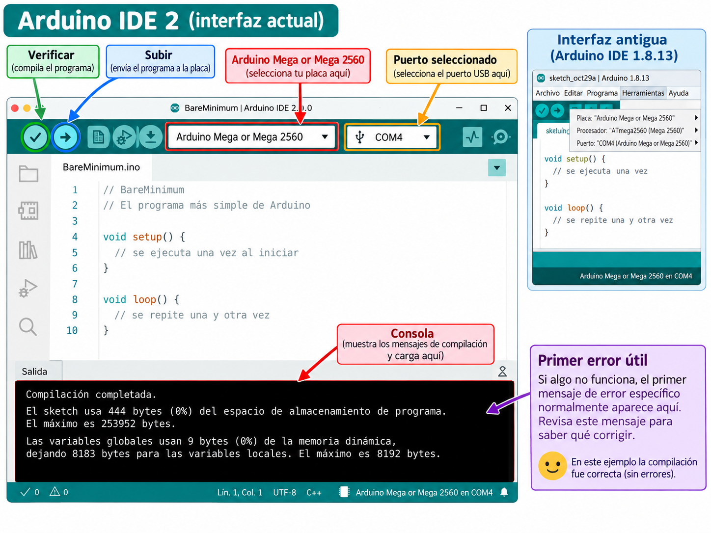

# Lección 05 — Preparar Arduino IDE

## Cuatro acciones que no significan lo mismo

En la pantalla de Arduino IDE hay dos botones parecidos: **Verificar** tiene forma de visto bueno y **Subir** tiene forma de flecha. Si los dos trabajan con código, ¿por qué existen ambos?

Un sketch recorre este camino:

1. Tú escribes código fuente que una persona puede leer.
2. El IDE lo **compila**: comprueba reglas del lenguaje y lo traduce para la placa elegida.
3. Al pulsar **Subir**, el computador transfiere el programa compilado por un **puerto** USB.
4. La Mega lo guarda en su memoria flash y lo ejecuta.

Verificar se detiene en el segundo paso. Subir realiza la compilación y después intenta comunicarse con una placa. Por eso un programa puede compilar correctamente y, aun así, no subir: quizá se eligió otro puerto, el cable solo transporta energía o alguna aplicación está ocupando la conexión.

La **placa** y el **puerto** tampoco son sinónimos. Elegir `Arduino Mega or Mega 2560` le dice al IDE para qué hardware debe preparar el programa. Elegir un puerto indica por cuál conexión debe enviarlo. En Scratch escogías un objeto y un escenario; aquí también debes decir con precisión quién ejecutará las instrucciones y por dónde llegarán.

Hoy no cargarás nada en PX-32. Dejarás listo el taller, compilarás un sketch vacío y descubrirás qué puerto aparece únicamente cuando conectas la Mega.

## Lo imprescindible antes de abrir el IDE

Necesitas recordar de la [Lección 04](../00-fundamentos/04-la-mega2560-una-computadora-pequena.md) que un archivo `.ino` contiene código fuente y que la Mega ejecuta instrucciones compiladas guardadas en flash. No hace falta memorizar su pinout.

Prepara:

- PX-32 ensamblado, apagado y sin USB.
- Un computador con Windows, macOS o una distribución Linux compatible.
- Arduino IDE 2, descargado desde la [página oficial de software](https://www.arduino.cc/en/software).
- El cable USB de datos de PX-32: extremo cuadrado tipo B para la Mega y el extremo compatible con el computador; si hace falta, su adaptador.
- Acceso al menú `Archivo > Ejemplos > 01.Basics > BareMinimum`.
- Un teléfono para registrar la orientación del conector del servo S1 antes de aislarlo.
- Un adulto para instalar el programa si el sistema solicita contraseña y para preparar la alimentación del robot.

🔴 Detente y llama a tu padre. Con el USB retirado, él debe apagar los interruptores, retirar las dos baterías 18650 y guardarlas de forma segura. Como no sabemos qué sketch quedó antes en la flash, también desconecta el conector del servo S1 sujetando su carcasa plástica y registra su orientación. En esta clase la única fuente de energía será el USB. Si no puede confirmar que potencia y servo quedaron aislados, realiza solo la parte de compilación y deja la prueba del puerto para después.

## Misión: distinguir compilar, conectar y cargar

### 1. Abre un programa que no hace nada

1. 🟢 Abre Arduino IDE 2. Reconócelo por el editor grande en el centro, la consola de mensajes en la parte inferior y el selector de placa cerca de la parte superior. El manual de OSOYOO muestra IDE 1.8.13; sus capturas sirven como antecedente, pero los controles actuales no están en el mismo lugar.

2. 🟢 Ve a `Archivo > Ejemplos > 01.Basics > BareMinimum`. Se abrirá un sketch con `setup()` y `loop()` vacíos. Se llama *BareMinimum* porque contiene la estructura mínima que espera Arduino.

```cpp
void setup() {
  // No hay preparaciones todavía.
}

void loop() {
  // No hay instrucciones para repetir todavía.
}
```

Los comentarios comienzan con `//`; el compilador los ignora. Las llaves `{ }` marcan el comienzo y el final de cada función. Aunque el sketch no produzca una acción, permite comprobar el taller sin cambiar el programa almacenado en la placa.

### 2. Dile al IDE para qué placa va a compilar

3. 🟢 Sin conectar aún PX-32, abre el selector de placa y elige `Select other board and port...` o su traducción. Escribe `Mega` y selecciona **Arduino Mega or Mega 2560** dentro de **Arduino AVR Boards**. El puerto puede quedar vacío por ahora.

4. 🟢 Si no aparece esa placa, abre el gestor de placas, busca `Arduino AVR Boards` e instala el paquete oficial. Un adulto debe acompañar este paso si el computador pide permisos o acceso a Internet. No elijas `UNO`, `Arduino Due` ni una placa que diga `ESP32`: PX-32 usa la Mega2560 como placa principal.

5. 🟢 Predice qué ocurrirá al pulsar el botón **Verificar**: ¿cambiará el robot o solo aparecerán mensajes en el computador?

6. 🟢 Pulsa **Verificar**. La consola debe terminar sin texto rojo de error y mostrar un resumen del espacio de programa y memoria usados. Los números pueden variar; la evidencia importante es que la compilación terminó correctamente para la Mega. Nada se ha enviado al robot.

Si aparece `Missing FQBN`, falta seleccionar la placa. Si aparece un error que menciona `setup` o `loop`, comprueba mayúsculas, paréntesis y llaves. Lee la primera línea específica del error, no solo la frase final `exit status 1`.

### 3. Encuentra el puerto por una prueba de aparición

7. 🟡 Tu padre permanece presente. Apoya PX-32 sobre una mesa seca y estable. Comprueben que no hay tornillos sobre las placas, cables sueltos, daño, calor ni olor. No enciendan ningún interruptor.

8. 🟡 Abre el selector de placa y observa la lista de puertos **antes** de conectar el cable. No necesitas memorizarla.

9. 🟡 Inserta suavemente el extremo USB tipo B en la Mega; su forma casi cuadrada ayuda a reconocerlo. Conecta el otro extremo al computador. No fuerces un conector ni uses el cable si está roto o doblado.

10. 🟢 Vuelve a abrir el selector. Busca el puerto nuevo. En Windows suele comenzar con `COM`; en macOS, con `/dev/cu.`; en Linux, con `/dev/ttyACM` o un nombre parecido. Puede aparecer como dispositivo desconocido: lo que lo identifica en esta prueba es que apareció al conectar PX-32.

11. 🟢 Selecciona ese puerto junto con `Arduino Mega or Mega 2560`. Luego desconecta el USB, actualiza la lista y comprueba que desaparece. Reconéctalo y confirma que vuelve. Esa doble comparación es más fiable que escoger el primer nombre disponible.

12. 🟢 No pulses **Subir** todavía. Di en voz alta: “el sketch compiló para la Mega; este puerto apareció con PX-32; aún no cambié la flash de la placa”.

13. 🟡 Cierra el IDE y retira el USB sujetando el conector, no el cable. 🔴 Sin ninguna fuente conectada, tu padre restaura el conector del servo S1 según la orientación registrada. PX-32 termina ensamblado y sin energía; las baterías siguen bajo responsabilidad del adulto.



## Cómo sabes que la misión está completa

Has terminado si puedes demostrar tres resultados diferentes:

- `BareMinimum` compila sin modificar la placa;
- la placa seleccionada es `Arduino Mega or Mega 2560`;
- un puerto aparece con PX-32, desaparece al retirar USB y reaparece al conectarlo.

Encenderse una luz de alimentación no demuestra que el cable lleve datos. Y ver un puerto no demuestra que el código compile. Cada observación responde una pregunta distinta.

## Si el taller no queda listo

| Lo que ves | Qué significa probablemente | Prueba pequeña |
|---|---|---|
| No aparece `Mega` entre las placas | Falta el paquete AVR o la búsqueda no coincide | Busca `Arduino AVR Boards` en el gestor de placas |
| `Missing FQBN` al verificar | No hay placa elegida | Selecciona Mega 2560; no hace falta un puerto para compilar |
| El LED de alimentación enciende, pero no aparece puerto | El cable puede ser solo de carga, el adaptador puede fallar o faltar un controlador | Prueba otro cable de datos conocido y otra toma USB, una cosa cada vez |
| Aparecen varios puertos | Otro dispositivo también usa una conexión serial | Repite la prueba conectar/desconectar y elige solo el que cambia |
| Linux informa `Permission denied` | El usuario no tiene permiso para abrir el dispositivo | Detente; el adulto revisa los permisos del sistema, sin copiar comandos desconocidos |
| La consola muestra texto rojo | Hay un error de compilación | Busca la primera línea que señale archivo y línea; revisa esa línea antes del mensaje genérico final |

No pulses **Subir** como prueba al azar. En la próxima clase sabrás qué programa vas a transferir y qué efecto esperar.

## Lecturas y videos para explorar

- [Estructura y lenguaje de Arduino](https://docs.arduino.cc/language-reference/) — Inglés; referencia oficial; 10 min. Aprenderás estructura y lenguaje de arduino. Esencial.
- [Ejemplos integrados de Arduino](https://docs.arduino.cc/built-in-examples/) — Inglés; tutorial oficial; 10 min. Aprenderás ejemplos integrados de arduino. Opcional.

Ahora puedes explorar esos recursos sabiendo separar un ejemplo que solo se abre, uno que compila y uno que se carga en una placa real.

## Referencias técnicas de la clase

- [Descarga e instalación de Arduino IDE](https://support.arduino.cc/hc/en-us/articles/360019833020-Download-and-install-Arduino-IDE), sistemas compatibles e instalación oficial.
- [Selección de placa y puerto en Arduino IDE 2](https://support.arduino.cc/hc/en-us/articles/4406856349970-Select-board-and-port-in-Arduino-IDE), selector y prueba de puerto.
- [Solución de errores de compilación](https://support.arduino.cc/hc/en-us/articles/4402764401554-If-your-sketch-doesn-t-compile), diferencia entre Verificar y Subir y lectura de la consola.
- [Proceso de construcción de un sketch](https://docs.arduino.cc/arduino-cli/sketch-build-process), tratamiento de archivos `.ino` y compilación.
- [Manual oficial de OSOYOO](https://osoyoo.com/manual/2021006600-2026.pdf), páginas 22 a 24; interfaz 1.8.13 conservada solo como referencia histórica.

## Cuéntale a papá

Muéstrale los dos botones y completa estas frases con tus palabras: “compilar sirve para…”, “cargar sirve para…” y “el puerto que pertenece a PX-32 es… porque…”. Después explícale por qué una luz encendida no prueba que un cable transporte datos.

En la [Lección 06](06-primer-programa-blink.md) sí usarás **Subir**: una instrucción escrita producirá una señal visible en el LED integrado.
