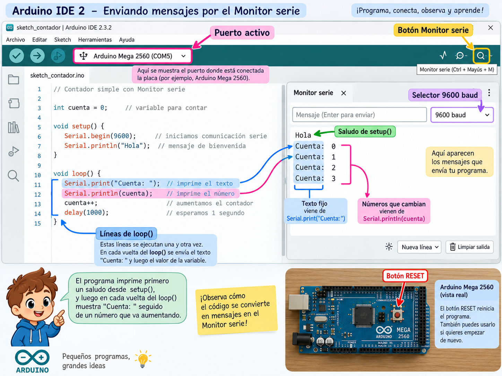

# Lección 08 — PX-32 aprende a hablarnos

## Ver algo que ocurre dentro del programa

El LED puede mostrar dos estados, pero no puede decirte si una cuenta vale 7 o 83. Para observar datos internos usaremos el **monitor serie**, una zona de Arduino IDE que muestra mensajes intercambiados entre el computador y la Mega.

`Serial` es el objeto de Arduino que usaremos para esa comunicación. En la Mega2560, `Serial` corresponde al puerto serie principal y se conecta con el computador mediante la interfaz USB de la placa. No es Wi-Fi, Bluetooth ni el `Serial1` reservado más adelante para esos módulos.

Los datos viajan como una secuencia de bits. Emisor y receptor deben acordar el ritmo, llamado **baud rate**. El sketch iniciará `Serial` a 9600 baudios y el monitor debe mostrar 9600 también. Si no coinciden, el receptor puede separar mal los bits y mostrar caracteres sin sentido.

En Scratch podías marcar una variable para verla en el escenario. `Serial.println()` cumple un propósito parecido: no cambia el comportamiento que estamos estudiando; hace visible un dato para entenderlo y depurarlo.

## Prepara la conversación por USB

Necesitas saber qué es una variable y qué hace una asignación, como en la [Lección 07](07-variables-para-representar-tiempo.md). Reúne:

- PX-32 ensamblado, apagado y sin baterías.
- Computador con Arduino IDE 2.
- Cable USB de datos.
- El archivo [08-px-32-aprende-a-hablarnos.ino](../../code/educational/08-px-32-aprende-a-hablarnos/08-px-32-aprende-a-hablarnos.ino).
- Una hoja para escribir las primeras cinco líneas que predices.
- Un adulto presente al conectar el USB.

Esta vez el sketch no configura D13 ni ningún pin de motor. El servo puede permanecer conectado si fue restaurado correctamente al final de la clase anterior. 🔴 El adulto debe confirmar que las baterías 18650 están retiradas, los interruptores apagados y el robot no presenta daño, calor u olor. La única alimentación será USB.

## El programa que deja pistas

1. 🟢 Abre el `.ino` y compáralo línea por línea con este bloque:

```cpp
// Curso PX-32 — Lección 08: mensajes por Serial USB.
unsigned long cuenta = 0;

void setup() {
  Serial.begin(9600);
  Serial.println("Hola, soy PX-32");
}

void loop() {
  Serial.print("Cuenta: ");
  Serial.println(cuenta);
  cuenta = cuenta + 1;
  delay(1000);
}
```

2. 🟢 Lee primero `setup()`:

- `Serial.begin(9600);` prepara la comunicación al ritmo acordado.
- `Serial.println("Hola, soy PX-32");` envía el texto entre comillas y después cambia de línea.

Como `setup()` se ejecuta una vez después de cada inicio o reinicio, el saludo debe aparecer una vez por arranque.

3. 🟢 Lee ahora `loop()`:

- `Serial.print("Cuenta: ");` escribe una etiqueta sin cambiar de línea.
- `Serial.println(cuenta);` escribe el valor actual y termina la línea.
- `cuenta = cuenta + 1;` calcula el valor anterior más uno y lo vuelve a asignar a la variable.
- `delay(1000);` deja aproximadamente un segundo entre mensajes.

`unsigned long` es un tipo de entero que no representa números negativos y admite valores mayores que `int` en la Mega. No necesitas memorizar su límite; aquí evita que una cuenta de tiempo corta se quede sin espacio enseguida.

4. 🟢 Antes de cargar, escribe las primeras líneas esperadas:

```text
Hola, soy PX-32
Cuenta: 0
Cuenta: 1
Cuenta: 2
Cuenta: 3
```

Fíjate en el orden: el valor se imprime antes de sumarle uno. Por eso la primera cuenta visible es 0.

## Abre la ventana correcta y acuerda la velocidad

5. 🟡 Con el adulto presente, conecta únicamente el USB. Selecciona `Arduino Mega or Mega 2560` y el puerto que aparece con PX-32.

6. 🟢 Pulsa **Verificar** y, si no hay errores, **Subir**. Espera a que termine la carga.

7. 🟢 Abre el monitor serie con el botón de la esquina superior derecha o mediante `Herramientas > Monitor serie`. Busca el selector de velocidad dentro del monitor y elige **9600 baud**.

8. 🟢 Observa al menos cinco cuentas. Compáralas con tu predicción. El saludo puede aparecer justo al abrir el monitor porque muchas configuraciones reinician la placa al abrir la conexión. Si pulsas el botón RESET de la Mega, la cuenta vuelve a 0 y el saludo reaparece: la variable estaba en SRAM, no guardada de forma permanente.



### Provoca una diferencia explicable

9. 🟢 Cambia **solo el selector del monitor** a otra velocidad, sin modificar ni volver a subir el sketch. Según el sistema, quizá veas caracteres ilegibles o no obtengas una representación útil. Esa salida no significa que la Mega haya olvidado el mensaje: monitor y sketch dejaron de coincidir.

10. 🟢 Devuelve el monitor a 9600. Si la salida legible regresa, acabas de aislar la causa. Después cambia en el código `delay(1000)` por `delay(500)`, verifica y sube. La cuenta debe avanzar aproximadamente dos veces por segundo; el baud rate continúa en 9600 porque no cambiaste la comunicación.

11. 🟢 La misión está completa cuando puedes señalar qué se ejecutó una vez, qué se repitió, por qué la primera cuenta fue 0 y por qué la velocidad del monitor no controla el intervalo de la cuenta.

## Cierra sin confundir detener el monitor con detener la placa

12. 🟢 Cierra el monitor serie. El microcontrolador continúa ejecutando `loop()` mientras tenga energía, aunque ya no veas los mensajes.

13. 🟡 Retira el USB sujetando el conector. Ahora sí se detienen el programa y la comunicación. PX-32 queda apagado y sin baterías. Al volver a conectarlo, el sketch almacenado arrancará desde `setup()` y la variable volverá a 0.

## Cuando PX-32 parece hablar otro idioma

| Lo que aparece | Prueba que separa causas |
|---|---|
| El monitor está vacío | Confirma que elegiste el puerto usado para subir y que el monitor está abierto después de la carga |
| Símbolos extraños | Iguala el selector del monitor con `Serial.begin(9600)` y reinicia una vez |
| Solo aparece el saludo | Revisa llaves: las líneas de cuenta deben estar dentro de `loop()`; verifica además que no falte `delay`, aunque su ausencia produciría demasiados mensajes, no silencio |
| La cuenta empieza de nuevo | La placa se reinició, se reconectó el puerto o se pulsó RESET; busca el saludo como evidencia del nuevo arranque |
| La cuenta avanza demasiado rápido | Revisa la unidad y el valor de `delay`; 1000 ms es un segundo |
| `cuenta` no cambia | Comprueba que existe `cuenta = cuenta + 1;` después de imprimir |
| El puerto informa que está ocupado | Cierra otros monitores o aplicaciones que lo estén usando antes de reintentar |

## Lecturas y videos para explorar

- [Estructura y lenguaje de Arduino](https://docs.arduino.cc/language-reference/) — Inglés; referencia oficial; 10 min. Aprenderás estructura y lenguaje de arduino. Esencial.
- [Ejemplos integrados de Arduino](https://docs.arduino.cc/built-in-examples/) — Inglés; tutorial oficial; 10 min. Aprenderás ejemplos integrados de arduino. Opcional.

Busca ejemplos que impriman una medición. Pregúntate qué dato interno hacen observable y qué velocidad deben compartir con el monitor.

## Referencias técnicas de la clase

- [Referencia del lenguaje Arduino](https://docs.arduino.cc/language-reference/), `Serial`, `print`, `println` y `delay`.
- [Pinout oficial de Arduino Mega 2560](https://docs.arduino.cc/resources/pinouts/A000067-full-pinout.pdf), UART principal y señales USB-serie.
- [Arduino Mega 2560 Rev3](https://docs.arduino.cc/hardware/mega-2560/), cuatro puertos serie de hardware y memoria de la placa.
- [Apertura del monitor serie en Arduino IDE](https://support.arduino.cc/hc/en-us/articles/360020366520-How-to-do-a-loopback-test), control de interfaz y envío/recepción.

## Cuéntale a papá

Muéstrale una cuenta legible y explica por qué `Serial.begin(9600)` y el selector del monitor deben coincidir. Luego cierra el monitor y responde: ¿el programa se detuvo?, ¿qué observación lo demostraría?, ¿por qué la cuenta regresa a cero después de reiniciar?

En la [Lección 09](09-decisiones-con-if-y-else.md) usarás esa cuenta para que el programa elija exactamente uno de dos mensajes.
