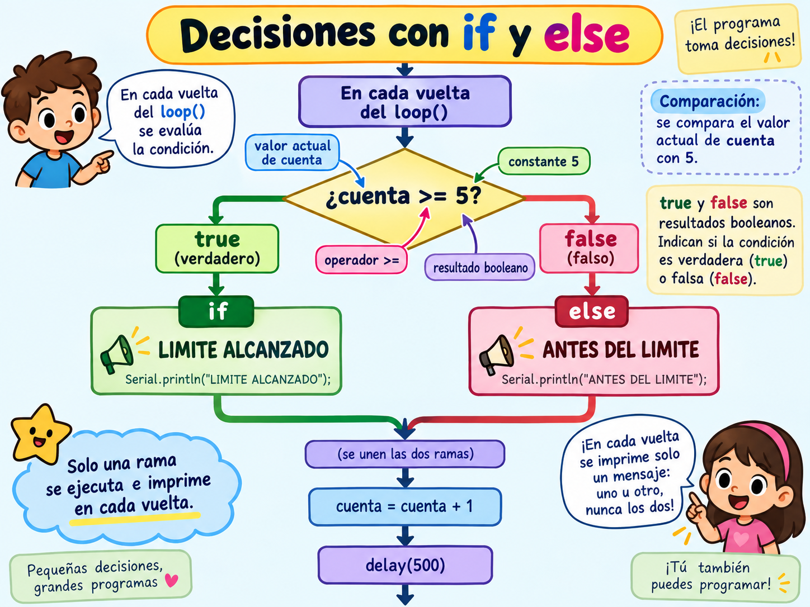

# Lección 09 — Decisiones con `if` y `else`

## El instante en que cambia el mensaje

Imagina una cuenta que muestra `ANTES` para 0, 1, 2, 3 y 4. Al llegar a 5 debe mostrar `LÍMITE ALCANZADO`. El programa no “se da cuenta” como una persona: compara dos números y sigue una regla escrita.

Una **comparación** produce un dato de tipo `bool`, que solo puede valer `true` o `false`. La expresión:

```cpp
cuenta >= LIMITE
```

pregunta si `cuenta` es mayor o igual que `LIMITE`. No cambia ninguno de los dos datos. El resultado puede guardarse así:

```cpp
bool alcanzoLimite = cuenta >= LIMITE;
```

Después, `if` examina ese resultado. Si es `true`, ejecuta el bloque entre sus primeras llaves. `else` contiene la alternativa para `false`. En una misma vuelta de `loop()` solo se ejecuta una de las dos **ramas**.

En Scratch, un bloque “si… entonces / si no” encajaba visualmente. En C++ las llaves cumplen esa tarea: muestran qué instrucciones pertenecen a cada camino.

## Antes de poner a prueba la condición

Debes saber abrir el monitor serie y reconocer una cuenta creciente de la [Lección 08](08-px-32-aprende-a-hablarnos.md). Necesitas:

- PX-32 ensamblado, apagado, sin USB y sin baterías.
- Computador con Arduino IDE 2 y cable USB de datos.
- El archivo [09-decisiones-con-if-y-else.ino](../../code/educational/09-decisiones-con-if-y-else/09-decisiones-con-if-y-else.ino).
- Una fila de seis tarjetas o trozos de papel numerados de 0 a 5.
- Un lápiz para marcar `true` o `false` bajo cada número.
- Un adulto presente al conectar USB.

El sketch solo enviará texto; no configurará motores, servo ni LED. 🔴 El adulto confirma que las baterías están retiradas y que no hay daño, calor, olor ni cables sueltos. La única energía será USB.

## Simula la decisión antes de ejecutar código

1. 🟢 Coloca las tarjetas 0 a 5 en orden. El límite será 5. Para cada tarjeta responde `¿número >= 5?` y escribe `false` bajo 0–4 y `true` bajo 5.

2. 🟢 Asigna un mensaje a cada resultado: `true → LIMITE ALCANZADO`; `false → ANTES DEL LIMITE`. Comprueba que ninguna tarjeta recibe los dos mensajes y ninguna queda sin mensaje.

3. 🟢 Predice las primeras seis líneas del monitor. Incluye el número para poder revisar exactamente dónde cambia la rama:

```text
Cuenta 0: ANTES DEL LIMITE
Cuenta 1: ANTES DEL LIMITE
Cuenta 2: ANTES DEL LIMITE
Cuenta 3: ANTES DEL LIMITE
Cuenta 4: ANTES DEL LIMITE
Cuenta 5: LIMITE ALCANZADO
```

## Sigue una vuelta completa del programa

4. 🟢 Abre el `.ino` y comprueba que coincide con este bloque:

```cpp
// Curso PX-32 — Lección 09: una comparación elige una rama.
const int LIMITE = 5;
unsigned int cuenta = 0;

void setup() {
  Serial.begin(9600);
}

void loop() {
  bool alcanzoLimite = cuenta >= LIMITE;

  Serial.print("Cuenta ");
  Serial.print(cuenta);
  Serial.print(": ");

  if (alcanzoLimite) {
    Serial.println("LIMITE ALCANZADO");
  } else {
    Serial.println("ANTES DEL LIMITE");
  }

  cuenta = cuenta + 1;
  delay(500);
}
```

5. 🟢 Imagina que `cuenta` vale 4. La comparación entrega `false`, se omite la primera rama y se ejecuta `else`. Solo después, `cuenta = cuenta + 1;` prepara el 5 para la vuelta siguiente.

6. 🟢 Imagina ahora que vale 5. `>=` incluye la igualdad, por lo que `alcanzoLimite` vale `true`. Si el operador fuera solo `>`, el cambio ocurriría en 6. Un carácter puede cambiar el comportamiento sin producir un error de compilación.

No confundas operadores: `=` asigna; `>=` compara “mayor o igual”. Más adelante encontrarás `==` para comparar igualdad. Escribir `=` donde querías comparar puede compilar en algunos contextos y producir una decisión equivocada.



## Observa el punto de cambio

7. 🟡 Conecta únicamente el USB con el adulto presente. Selecciona la Mega y su puerto, verifica y sube el sketch.

8. 🟢 Abre el monitor serie a 9600 baudios. Busca la última línea `ANTES DEL LIMITE` y la primera `LIMITE ALCANZADO`. Deben corresponder a 4 y 5. Desde 5 en adelante la condición sigue siendo verdadera, así que el segundo mensaje continúa.

9. 🟢 Pulsa RESET una vez. La variable se inicializa otra vez en 0 y podrás observar de nuevo la frontera completa. El reinicio no cambia `LIMITE`, porque su valor está escrito en el sketch guardado.

10. 🟢 Cierra el monitor, retira el USB y cambia **solo** `const int LIMITE = 5;` por `const int LIMITE = 3;`. Predice la nueva frontera, verifica, conecta y sube. Ahora la última línea anterior debe ser 2 y la primera de límite, 3.

11. 🟢 Explica por qué no basta ver ambos mensajes en algún momento: la evidencia es que aparecen asociados a los números correctos y nunca los dos en la misma línea.

12. 🟡 Cierra el monitor y retira el USB. PX-32 queda apagado y sin baterías. El sketch puede permanecer en flash porque no configura salidas físicas del robot.

## Si la rama cambia donde no esperabas

| Síntoma | Inspección concreta |
|---|---|
| Cambia en 6 y no en 5 | Revisa si escribiste `>` en vez de `>=` |
| Siempre imprime `LIMITE ALCANZADO` desde 0 | Comprueba el sentido de la comparación y que `cuenta` inicie en 0 |
| Los dos mensajes aparecen en una vuelta | Revisa las llaves; `else` debe pertenecer al mismo `if` y cada rama contiene un solo `println` |
| Nunca llega al límite | Busca `cuenta = cuenta + 1;` después de las ramas |
| El número no coincide con el mensaje | Imprime `cuenta` antes de actualizarla y conserva la actualización al final |
| Error cerca de `else` | Verifica que la llave del bloque `if` cierre justo antes de `else` y que no haya un punto y coma después de `if (...)` |
| Salida ilegible | Iguala el monitor con `Serial.begin(9600)`; no cambies la condición para arreglar comunicación |

## Una pregunta para llevar al robot

Un sensor también puede producir una condición, pero eso vendrá después. `if` no sabe qué es un obstáculo: solo recibe un resultado verdadero o falso construido a partir de datos. Antes de permitir que una rama mueva motores, aprenderás a imprimir primero la lectura y la decisión.

## Lecturas y videos para explorar

- [Estructura y lenguaje de Arduino](https://docs.arduino.cc/language-reference/) — Inglés; referencia oficial; 10 min. Aprenderás estructura y lenguaje de arduino. Esencial.
- [Ejemplos integrados de Arduino](https://docs.arduino.cc/built-in-examples/) — Inglés; tutorial oficial; 10 min. Aprenderás ejemplos integrados de arduino. Opcional.

En los ejemplos de estructuras de control, busca el `if` oficial y comprueba qué dato produce su condición antes de mirar las acciones de las ramas.

## Referencias técnicas de la clase

- [Referencia del lenguaje Arduino](https://docs.arduino.cc/language-reference/), `if...else`, operadores de comparación y tipo `bool`.
- [Ejemplos integrados de estructuras de control](https://docs.arduino.cc/built-in-examples), ejemplo oficial de una sentencia condicional.
- [Ayuda oficial para errores de compilación](https://support.arduino.cc/hc/en-us/articles/4402764401554-If-your-sketch-doesn-t-compile), lectura de llaves, ámbitos y mensajes de la consola.

## Cuéntale a papá

Usa las tarjetas para narrar qué ocurre con 4 y con 5. Debes nombrar el dato comparado, el resultado booleano, la rama elegida y el momento en que aumenta la cuenta. Después explica por qué cambiar `>=` por `>` sería un error de comportamiento aunque el sketch pudiera compilar.

En la [Lección 10](10-repeticiones-contadas-con-for.md) reunirás inicio, condición y actualización en una estructura que cuenta repeticiones.
