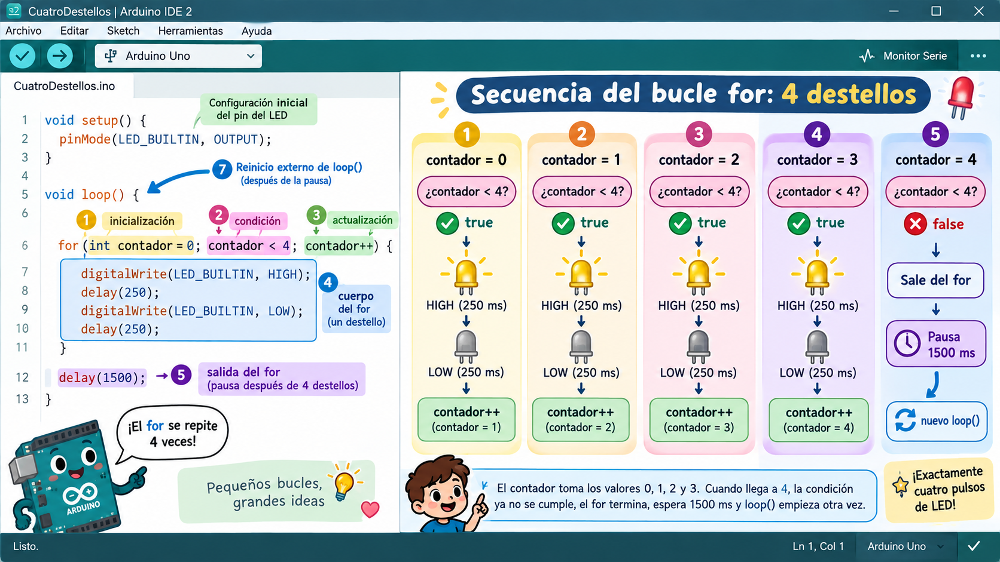

# Lección 10 — Repeticiones contadas con `for`

## ¿Cómo pides exactamente cuatro destellos?

Podrías copiar cuatro veces las instrucciones de encender, esperar, apagar y esperar. Funcionaría, pero cambiar de cuatro a seis exigiría copiar más código y aumentaría las oportunidades de equivocarte.

Un bucle `for` reúne tres decisiones de conteo en una sola línea:

```cpp
for (int contador = 0; contador < DESTELLOS; contador = contador + 1)
```

Léela por partes, separadas por punto y coma:

1. `int contador = 0` crea el contador al entrar en el bucle.
2. `contador < DESTELLOS` pregunta antes de cada repetición si puede continuar.
3. `contador = contador + 1` actualiza la cuenta después de ejecutar el bloque.

Con `DESTELLOS = 4`, el bloque corre para los valores 0, 1, 2 y 3. Cuando el contador llega a 4, la pregunta `4 < 4` es falsa y el programa sale del `for`. Empezar en cero no produce un destello extra: cuenta cuatro valores válidos.

No confundas los dos bucles de la clase. Arduino llama `loop()` repetidamente mientras haya energía. Dentro de cada vuelta, nuestro `for` producirá un grupo finito de destellos y terminará.

## Materiales y estado inicial

Debes poder explicar una condición y una actualización como en la [Lección 09](09-decisiones-con-if-y-else.md). Prepara:

- PX-32 ensamblado, apagado y sin USB.
- Computador con Arduino IDE 2 y cable USB de datos.
- El archivo [10-repeticiones-contadas-con-for.ino](../../code/educational/10-repeticiones-contadas-con-for/10-repeticiones-contadas-con-for.ino).
- Cuatro monedas, fichas o trozos de papel para simular el contador.
- Un adulto para retirar baterías y aislar el servo S1.

🔴 Con todas las fuentes desconectadas, tu padre retira las baterías 18650 y desconecta el conector del servo en S1 sujetando el plástico. D13 controla el LED integrado y comparte señal con S1. Registren la orientación para restaurar el conector al final. Si no pueden confirmar el aislamiento, realiza la simulación y verifica el código sin subirlo.

## Haz de contador antes que la Mega

1. 🟢 Coloca cuatro fichas en fila y nómbralas 0, 1, 2 y 3. Para cada una, evalúa `contador < 4`. Después de la ficha 3, prueba el valor 4 y detente porque la condición es falsa.

2. 🟢 Predice qué cambiaría con `DESTELLOS = 2` y con `DESTELLOS = 6`. No necesitas escribir seis copias de las instrucciones; cambia el límite de la comparación.

3. 🟢 Abre el `.ino` y comprueba este programa completo:

```cpp
// Curso PX-32 — Lección 10: contar destellos con for.
const int DESTELLOS = 4;
const int INTERVALO_MS = 150;

void setup() {
  pinMode(LED_BUILTIN, OUTPUT);
}

void loop() {
  for (int contador = 0; contador < DESTELLOS; contador = contador + 1) {
    digitalWrite(LED_BUILTIN, HIGH);
    delay(INTERVALO_MS);

    digitalWrite(LED_BUILTIN, LOW);
    delay(INTERVALO_MS);
  }

  delay(1500);  // Separa un grupo del siguiente.
}
```

4. 🟢 Sigue una vuelta completa. Cada valor permitido ejecuta un encendido de 150 ms y un apagado de 150 ms. Cuatro repeticiones tardan 1200 ms. Después del `for`, la pausa de 1500 ms crea una separación visible antes de que `loop()` comience otro grupo.

5. 🟢 Predice qué verías si `contador` nunca aumentara. La condición seguiría siendo verdadera y el `for` no terminaría. Predice también qué ocurriría si empezara en 1: con la misma comparación habría solo tres valores válidos, 1, 2 y 3.



## Cuenta con los ojos y comprueba con una variación

6. 🟡 Tu padre confirma otra vez batería retirada y servo S1 desconectado. Conecta solo el USB, selecciona la Mega y su puerto, verifica y sube el sketch.

7. 🟢 Observa un grupo completo. Cuenta cada transición de apagado a encendido como un destello. Debes contar cuatro, notar una pausa más larga y volver a contar cuatro. Si cuentas los cambios de estado —encendido y apagado— obtendrías ocho; por eso definimos de antemano qué cuenta como destello.

8. 🟢 Retira el USB. Cambia únicamente `DESTELLOS` a 2, verifica y sube. El intervalo de cada destello y la pausa entre grupos deben conservarse; solo cambia la cantidad.

9. 🟢 Repite con `DESTELLOS = 6`. Antes de mirar el LED, predice la duración del grupo: 6 × 300 ms = 1800 ms. No hace falta medir con cronómetro para aceptar la prueba; cuenta seis pulsos y explica el cálculo.

10. 🟢 Vuelve a 4. Con USB retirado, cambia temporalmente `<` por `<=` y razona sin subir: los valores válidos serían 0, 1, 2, 3 y 4, es decir, cinco destellos. Restaura `<` y verifica. Este es un error de límite: la sintaxis es válida, pero el conteo no coincide con la intención.

11. 🟢 Considera la misión completa si puedes anticipar la serie de valores del contador y obtener 2, 4 y 6 destellos cambiando solo una constante.

## Restaura el robot

12. 🟡 Sube `Archivo > Ejemplos > 01.Basics > BareMinimum` para retirar de D13 la salida repetitiva antes de reconectar el servo.

13. 🟡 Desconecta el USB. 🔴 Tu padre restaura el conector de S1 según la orientación registrada. El robot termina ensamblado, apagado y sin baterías.

## Si el grupo no tiene la cantidad prometida

| Resultado | Lugar exacto para mirar |
|---|---|
| Hay cinco destellos con límite 4 | La comparación probablemente usa `<=`; debe ser `contador < DESTELLOS` |
| Hay tres destellos | Comprueba si el contador empieza en 1 en vez de 0 |
| El grupo nunca termina | Verifica la actualización `contador = contador + 1` y que aumente, no disminuya |
| No se distingue la pausa entre grupos | Confirma que `delay(1500)` esté después de cerrar la llave del `for` |
| Cada grupo tiene otra cantidad | `DESTELLOS` debe ser constante y no recibir asignaciones dentro del bucle |
| Error cerca de la línea `for` | Debe haber dos puntos y coma dentro de los paréntesis; las tres partes no terminan con un tercer punto y coma |
| El servo responde | Retira USB; el adulto revisa el aislamiento de S1 antes de otra prueba |

## Lecturas y videos para explorar

- [Estructura y lenguaje de Arduino](https://docs.arduino.cc/language-reference/) — Inglés; referencia oficial; 10 min. Aprenderás estructura y lenguaje de arduino. Esencial.
- [Ejemplos integrados de Arduino](https://docs.arduino.cc/built-in-examples/) — Inglés; tutorial oficial; 10 min. Aprenderás ejemplos integrados de arduino. Opcional.

Compara otros `for` con el de esta clase: localiza siempre sus tres partes y pregunta qué valores reales toma el contador.

## Referencias técnicas de la clase

- [Referencia del lenguaje Arduino](https://docs.arduino.cc/language-reference/), estructura `for`, asignación y comparaciones.
- [Ejemplo integrado For Loop Iteration](https://docs.arduino.cc/built-in-examples/control-structures/ForLoopIteration/), repetición contada oficial.
- [Pinout oficial de Arduino Mega 2560](https://docs.arduino.cc/resources/pinouts/A000067-full-pinout.pdf), D13 y `LED_BUILTIN`.
- [Manual oficial de OSOYOO](https://osoyoo.com/manual/2021006600-2026.pdf), páginas 13 y 17, conexión D13/S1 que exige aislamiento.

## Cuéntale a papá

Usa las fichas para explicarle por qué 0, 1, 2 y 3 representan cuatro repeticiones. Señala en el código dónde empieza la cuenta, dónde decide continuar y dónde aumenta. Termina explicando la diferencia entre el `for` que acaba y el `loop()` de Arduino que vuelve a comenzar.

En la [Lección 11](11-funciones-ensenar-una-accion-reutilizable.md) darás un nombre a todo el grupo de destellos para reutilizarlo con distintos argumentos.
