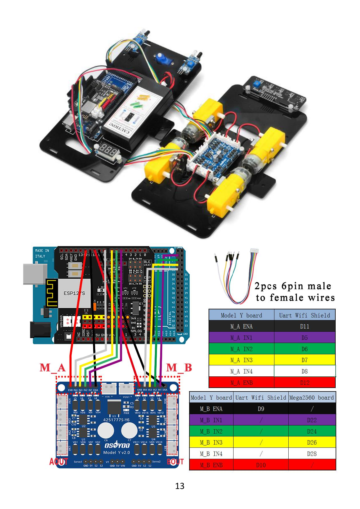
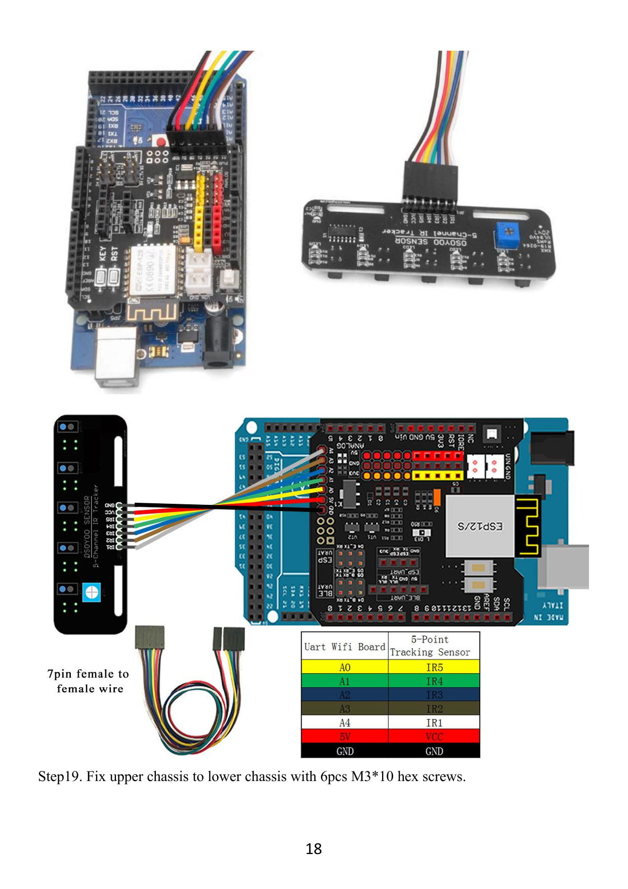

# Mapa canónico de conexiones de PX-32

**Regla:** no cambiar ninguna conexión con baterías, USB o interruptores encendidos. Si una lección contradice este archivo, detenerse y revisar [errata-osoyoo.md](errata-osoyoo.md).

## Ruta de energía documentada

```text
2 x 18650 -> portabaterías -> VIN Model Y
                                  |
                                  +-> motores
                                  +-> voltímetro
                                  +-> VOUT -> VIN UART WiFi Shield -> Mega y módulos
```

La configuración interna serie/paralelo del portabaterías y límites del Model Y están `PENDIENTE_DE_VERIFICAR`; no se extrapolan voltajes.

## Motor driver

| Model Y | Mega/shield | Función |
|---|---:|---|
| M_A ENA | D11 | Habilitación/PWM |
| M_A IN1 | D5 | Dirección |
| M_A IN2 | D6 | Dirección |
| M_A IN3 | D7 | Dirección |
| M_A IN4 | D8 | Dirección |
| M_A ENB | D12 | Habilitación/PWM |
| M_B ENA | D9 | Habilitación/PWM |
| M_B IN1 | D22 | Dirección |
| M_B IN2 | D24 | Dirección |
| M_B IN3 | D26 | Dirección |
| M_B IN4 | D28 | Dirección |
| M_B ENB | D10 | Habilitación/PWM |



## Motores

| Posición | Conector Model Y |
|---|---|
| Frontal derecho | BK1 |
| Frontal izquierdo | BK3 |
| Trasero derecho | AK1 |
| Trasero izquierdo | AK3 |

## Tracker de cinco canales

| Tracker | Mega/shield |
|---|---|
| IR1 | A4 |
| IR2 | A3 |
| IR3 | A2 |
| IR4 | A1 |
| IR5 | A0 |
| VCC | 5V |
| GND | GND |

El diagrama, no el texto defectuoso, define esta tabla.



## Sensores IR de obstáculos

| Sensor | OUT | Alimentación |
|---|---|---|
| Izquierdo | D3 | 5V y GND |
| Derecho | D2 | 5V y GND |

## Ultrasónico y servo

| Dispositivo | Señal | Conexión |
|---|---|---|
| Ultrasónico | VCC | 5V |
| Ultrasónico | TRIG | D30 |
| Ultrasónico | ECHO | D31 |
| Ultrasónico | GND | GND |
| MG90 | Señal naranja | Model Y S1 -> D13 |
| MG90 | Rojo | Model Y 5V |
| MG90 | Marrón | Model Y GND |

## Bluetooth o Wi-Fi por Serial1

| Modo | Shield TX -> Mega | Shield RX <- Mega |
|---|---|---|
| Bluetooth | B_TX -> D19/RX1 | B_RX <- D18/TX1 |
| Wi-Fi | E_TX -> D19/RX1 | E_RX <- D18/TX1 |

Bluetooth y ESP comparten Serial1. El manual indica retirar la ruta B y conectar la ruta E al pasar a Wi-Fi.

## Luces y voltímetro

| Dispositivo | Conexión documentada |
|---|---|
| Cada LED delantero | rojo a 3.3V o 5V, negro a GND |
| Voltímetro | GND->GND, VCC->5V, VT->S del Model Y |

## Fuentes

Manual OSOYOO, pp. 13, 15-18, 29, 35, 40, 45 y 52-53.
