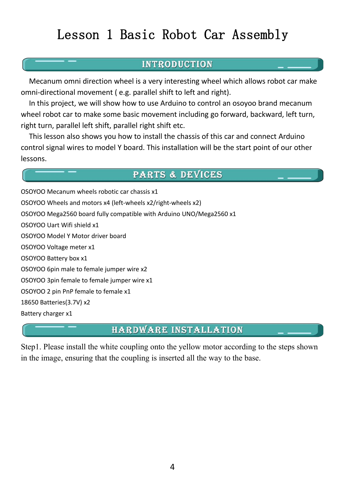
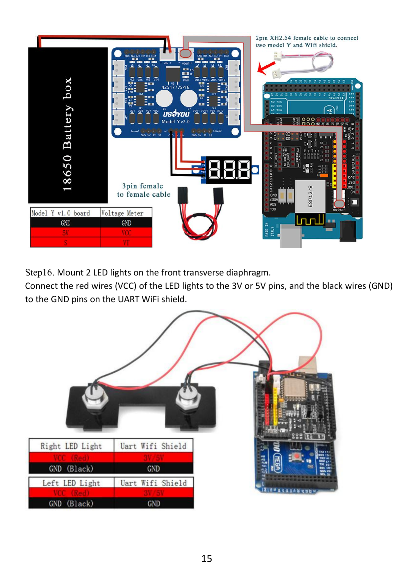
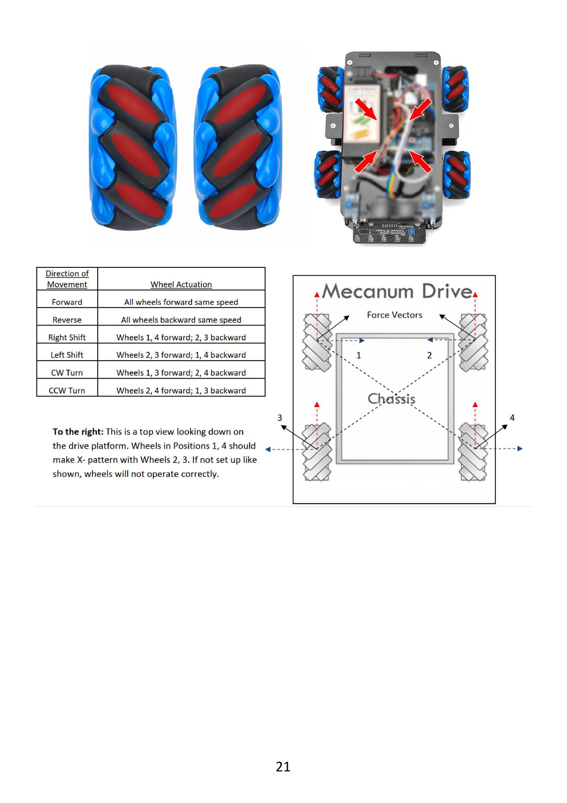
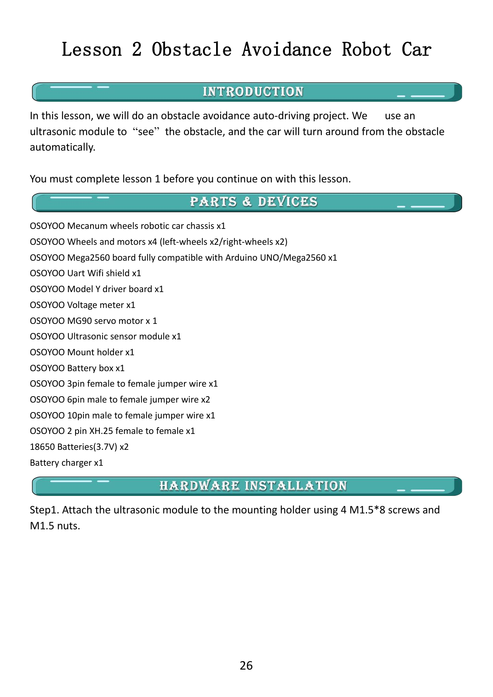
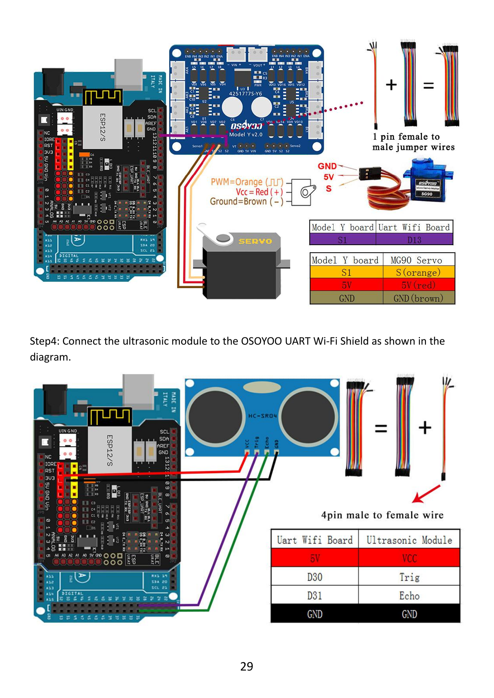
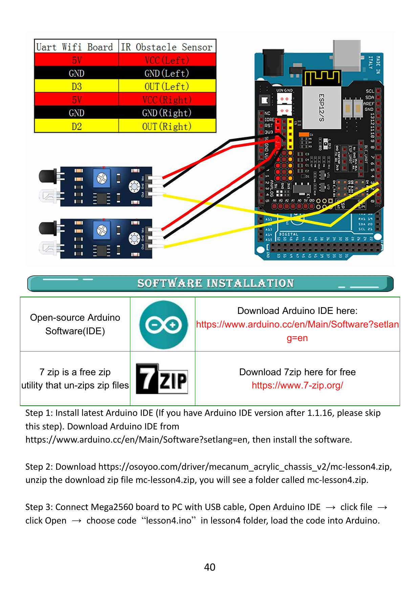
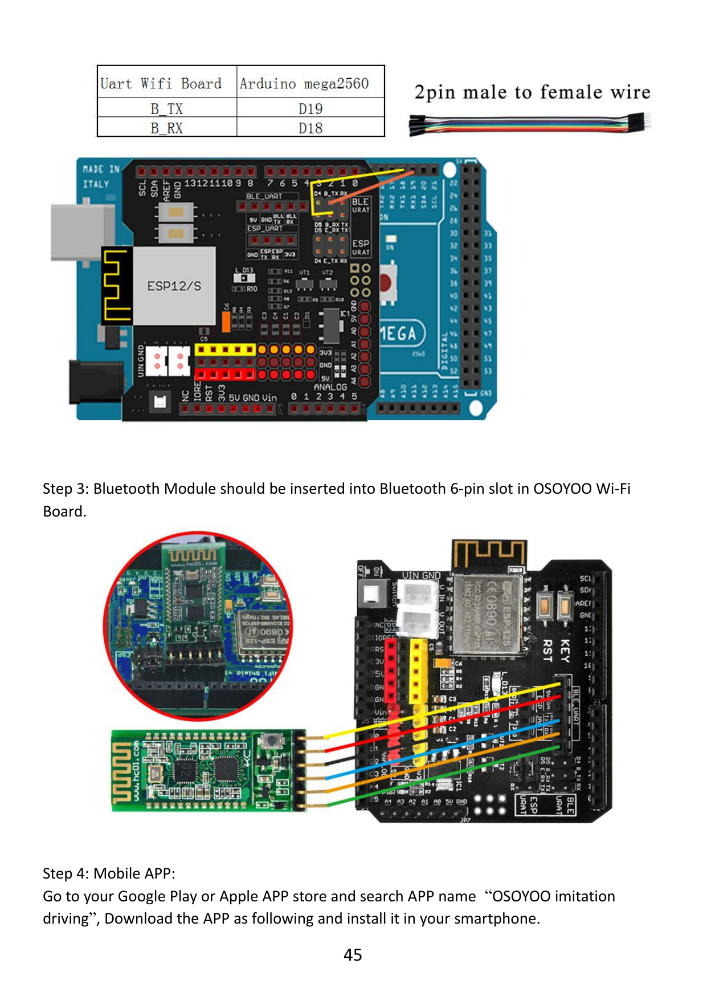
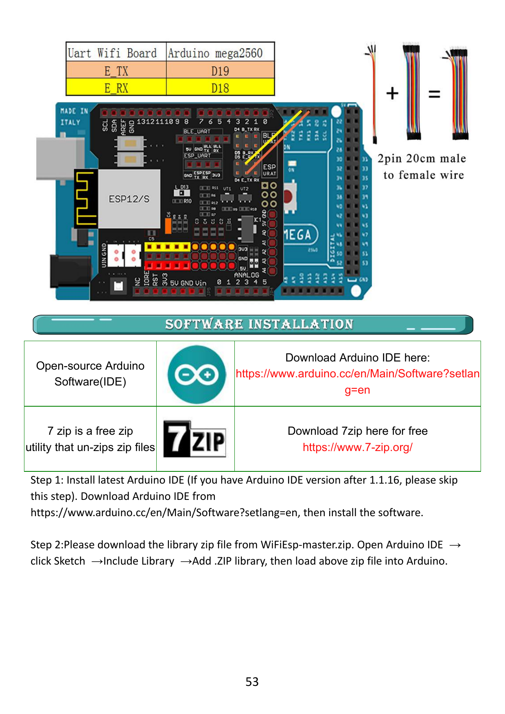

# Manual OSOYOO V2 - versión limpia y verificable

> **Naturaleza del documento:** reorganización fiel en español del PDF entregado. No sustituye el PDF para montaje. Las páginas citadas corresponden al número impreso y al PDF de 61 páginas. Cuando existe una discrepancia, se enlaza a [errata-osoyoo.md](../docs/reference/errata-osoyoo.md).

## Fuente primaria

[OSOYOO Mecanum Wheel Robotic Car Kit V2 for Arduino](original/osoyoo-mecanum-wheel-robotic-car-kit-v2.pdf). El [OCR original](original/osoyoo-mecanum-wheel-robotic-car-kit-v2-ocr.md) se preserva solo como ayuda de búsqueda.

## Introducción (pp. 1-2)

**OSOYOO:** las ruedas Mecanum incorporan rodillos inclinados 45° respecto al eje. La combinación del sentido de cuatro ruedas permite avanzar, retroceder, desplazarse lateral o diagonalmente y rotar. El kit incluye una placa OSOYOO Mega2560, un UART WiFi Shield con ESP8266, control Bluetooth, Wi-Fi, seguimiento de línea, evasión de obstáculos y seguimiento de objetos.

## Índice original (p. 3)

1. Basic Robot Car Assembly - p. 4
2. Obstacle Avoidance Robot Car - p. 26
3. Tracking Line Robot Car - p. 34
4. Object Follow Robot Car - p. 39
5. Imitation Driving With Bluetooth - p. 44
6. WiFi IoT Controlled Robot Car - p. 52

El manual afirma en su introducción que ofrece cinco lecciones, pero contiene seis; ver E-004.

---

# Lección original 1 - Montaje y movimiento básico (pp. 4-25)

## Propósito original

Montar el chasis y cargar un programa que ejecuta movimientos Mecanum básicos.

## Partes enumeradas (p. 4)

Chasis, cuatro motores y ruedas, Mega2560, UART WiFi Shield, Model Y, voltímetro, portabaterías, dos cables de seis pines, cable de tres pines, cable de dos pines, dos baterías 18650 de 3.7 V y cargador.

## Secuencia mecánica (pp. 4-12)

1. Insertar acoples blancos hasta la base de los ejes.
2. Instalar soportes metálicos y fijar cuatro motores al chasis inferior.
3. Fijar Model Y al chasis inferior.
4. Conectar motores: frontal derecho BK1, frontal izquierdo BK3, trasero derecho AK1, trasero izquierdo AK3.
5. Montar tracker inferior, separadores, portabaterías, voltímetro, Mega2560 y shield.
6. Montar servo, sensores IR y luces frontales.

Toda operación mecánica o eléctrica se hace sin alimentación.

## Conexión del Model Y (p. 13)

| Zona | Señal | Mega/shield |
|---|---|---:|
| M_A | ENA, IN1, IN2, IN3, IN4, ENB | D11, D5, D6, D7, D8, D12 |
| M_B | ENA, IN1, IN2, IN3, IN4, ENB | D9, D22, D24, D26, D28, D10 |

OSOYOO advierte sujetar la carcasa plástica al retirar el cable de seis pines, nunca los hilos.

## Alimentación, voltímetro y luces (pp. 14-16)

- Portabaterías a VIN del Model Y.
- VOUT del Model Y a VIN del UART WiFi Shield mediante cable de dos pines.
- Voltímetro: GND a GND, VCC a 5V y VT a S.
- Cada luz delantera: rojo a 3.3V o 5V; negro a GND. El manual indica que cambia el brillo.

La tabla del voltímetro dice Model Y v1.0 aunque la placa está marcada V2.0; ver E-002.

## Servo y tracker (pp. 16-18)

Servo MG90: señal naranja a S1 del Model Y, rojo a 5V y marrón a GND. S1 llega a D13.

Tracker:

| IR1 | IR2 | IR3 | IR4 | IR5 | VCC | GND |
|---|---|---|---|---|---|---|
| A4 | A3 | A2 | A1 | A0 | 5V | GND |

El texto de p. 17 repite A3 y omite A0. El diagrama de p. 18 coincide con el de p. 35 y se adopta como canónico.

## Ruedas Mecanum (pp. 19-22)

Las cuatro ruedas existen en dos orientaciones. Vistas desde arriba, los rodillos deben apuntar hacia el centro formando una X. Las posiciones 1 y 4 usan una orientación; 2 y 3, la otra.

## Software y prueba original (pp. 22-25)

El manual muestra Arduino IDE 1.8.x, selección `Arduino Mega or Mega 2560`, procesador ATmega2560 y un puerto COM de ejemplo. El curso PX-32 usa Arduino IDE 2 y explica macOS/Ubuntu en la Lección 05.

La secuencia original mueve el robot adelante, atrás, giros, desplazamientos laterales y diagonales. OSOYOO indica programar antes de instalar/activar baterías. Si una mitad no gira o gira en un solo sentido, propone revisar el cable de seis pines.

---

# Lección original 2 - Evasión de obstáculos (pp. 26-33)

## Partes añadidas

MG90, módulo ultrasónico, soporte, tornillos y jumpers. La lista identifica explícitamente `OSOYOO MG90 servo motor x1`.

## Montaje y conexión

El ultrasónico se fija al soporte y el soporte al servo. Se conservan las conexiones anteriores.

| Ultrasónico | Shield |
|---|---:|
| VCC | 5V |
| TRIG | D30 |
| ECHO | D31 |
| GND | GND |

## Prueba original

Al encender, el servo debe centrar el sensor durante los primeros segundos. OSOYOO indica apagar inmediatamente y corregir mecánicamente si no apunta al frente. Después el programa avanza, se detiene ante obstáculos, escanea y decide girar o retroceder.

Para diagnóstico, el manual propone un programa de distancia y el Serial Monitor. Un valor constante de cero puede indicar cableado o sensor defectuoso; el curso distinguirá timeout de una distancia real.

---

# Lección original 3 - Seguimiento de línea (pp. 34-38)

## Propósito y conexión

El programa lee cinco canales para seguir una pista negra sobre fondo blanco. El texto de p. 34 duplica A2; el diagrama de p. 35 confirma el mismo mapa canónico de p. 18.

## Prueba original

OSOYOO recomienda una pista negra de más de 20 mm y menos de 30 mm sobre fondo blanco, sin curvas demasiado cerradas. El sensor central comienza sobre la línea.

El curso PX-32 no cargará primero el programa completo: antes imprimirá los cinco bits, calibrará, representará posición y mostrará decisiones sin motores.

---

# Lección original 4 - Seguimiento de objeto por IR (pp. 39-43)

## Conexión

| Sensor | VCC | GND | OUT |
|---|---|---|---:|
| Izquierdo | 5V | GND | D3 |
| Derecho | 5V | GND | D2 |

## Comportamiento original

Con ambos sensores activos el robot avanza hacia el objeto; con uno, corrige hacia ese lado; el ultrasónico impide acercarse más allá del umbral programado. El manual describe una parada alrededor de 10 cm.

El curso separará reflexión IR, comparador, ajuste de umbral, lectura de uno y dos sensores y combinación con distancia antes del hito.

---

# Lección original 5 - Conducción por Bluetooth (pp. 44-51)

## Conexión normal

| Shield | Mega2560 |
|---|---:|
| B_TX | D19/RX1 |
| B_RX | D18/TX1 |

El HC-02 se inserta en el zócalo Bluetooth del shield.

## Interfaz y prueba original

El manual usa una aplicación móvil OSOYOO, emparejamiento con HC-02 y controles de motor, velocidad, marcha, dirección y movimientos Mecanum. Menciona el código `1234` para emparejar; debe verificarse en el módulo real.

La sección de cambio de nombre usa D4/D5 con `SoftwareSerial` y muestra una imagen rotulada HC-05 mientras el texto dice HC-02. Ese procedimiento queda pospuesto; ver E-010.

---

# Lección original 6 - Control Wi-Fi/IoT (pp. 52-61)

## Cambio de ruta UART

OSOYOO pide retirar la ruta Bluetooth y conectar la ruta ESP:

| Shield | Mega2560 |
|---|---:|
| E_TX | D19/RX1 |
| E_RX | D18/TX1 |

## Software y modos

El manual describe una biblioteca WiFiEsp, una app UDP y dos programas:

- **STA:** PX-32 se une a un router, recibe una IP por DHCP y el teléfono se comunica en la misma red.
- **AP:** el propio módulo crea una red a la cual se conecta el teléfono.

Las capturas, nombres de tiendas y descargas pueden cambiar. El curso verificará recursos vigentes al llegar a este bloque y nunca guardará contraseñas reales en Git.

## Protocolo original

La aplicación envía comandos de una letra mediante UDP. Esto inspira las lecciones de cliente/servidor, mensajes, pérdida de paquetes, parada segura y telemetría.

---

# Índice de imágenes seleccionadas

| Página | Archivo | Uso pedagógico |
|---:|---|---|
| 4 | `pagina-04-inventario-kit.png` | Inventario inicial |
| 13 | `pagina-13-conexiones-model-y.png` | Control de motores |
| 15 | `pagina-15-alimentacion-y-leds.png` | Potencia y voltímetro |
| 17-18 | `pagina-17...`, `pagina-18...` | Mostrar errata y mapa correcto |
| 21 | `pagina-21-orientacion-mecanum.png` | Orientación y fuerzas |
| 23 | `pagina-23-ide-clasico.png` | Referencia histórica IDE 1.8 |
| 26 | `pagina-26-inventario-ultrasonido-mg90.png` | Confirmación MG90 |
| 29 | `pagina-29-conexion-ultrasonico.png` | TRIG/ECHO |
| 40 | `pagina-40-conexion-ir-obstaculos.png` | IR izquierdo/derecho |
| 45 | `pagina-45-conexion-bluetooth.png` | HC-02 y UART |
| 53 | `pagina-53-conexion-wifi-uart.png` | ESP UART |
